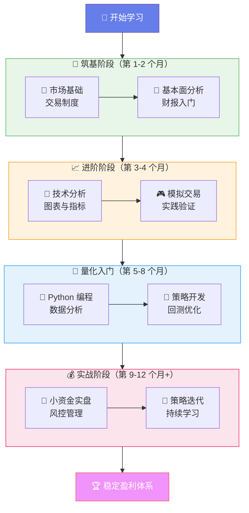

# Stock EVA

Stock EVA 是面向上交所、深交所 A 股主板的轻量收盘后研究工作台，覆盖市场复盘、
手动持仓与自选、可组合策略选股、全市场规则扫描和收盘后预警。现有 `dashboard/`
学习页面保持独立。当前版本不连接券商，不包含实时行情、外部通知、自动交易、盘中
实时扫描或投资建议。

五阶段第一版已经完成并通过本机真实验收。BaoStock 全主板 NAS 历史归档包含
260 个交易日、829,494 行、约 38 MB，最新日期 2026-07-24；manifest、SHA-256、
Parquet schema 和行数已经真实校验。本机日终增量已更新到 2026-07-27，已验证镜像
包含 261 个交易日、832,687 行。由于 macOS TCC 拒绝 LaunchAgent 直接访问
`/Volumes/Stock`，正式后台服务不从 NAS 或 `Documents` 开发仓库运行，而是读取
`~/Library/Application Support/Stock EVA/data/market-dataset` 的已验证本机镜像。
NAS 保留为历史归档源，本机 DuckDB/SQLite 保存控制状态和用户私有数据。5 个
LaunchAgent、端口、storage readiness、日历、日终刷新、私有库备份以及桌面/移动
浏览器均已读回验收。详细状态见
[五阶段交付与验收状态](docs/five-stage-status.md)。

## 工程快速开始

要求 Python 3.12 和 [uv](https://docs.astral.sh/uv/)。

```bash
uv sync --extra dev
uv run uvicorn backend.app.main:app --reload
```

另开一个终端，从项目根目录提供静态页面：

```bash
uv run python -m backend.app.static_server \
  --host 127.0.0.1 \
  --port 8080 \
  --directory .
```

打开 `http://127.0.0.1:8080/` 可分别进入 Stock EVA 复盘工作台与既有学习知识库。
静态服务只接受 IPv4 loopback 地址，并为所有响应设置
`Cache-Control: no-store`，避免固定文件名的 HTML、JavaScript 和 CSS 在升级时混装。
工作台只读取 `http://127.0.0.1:8000/api/v1`；行情为空、部分、过期或失败时会保留
对应状态，不使用演示数字补位。持仓、自选和策略状态只写入本地 SQLite。

可用端点：

- `GET http://127.0.0.1:8000/api/v1/health`
- `GET http://127.0.0.1:8000/api/v1/storage/readiness`
- `GET http://127.0.0.1:8000/api/v1/market/status`
- `GET http://127.0.0.1:8000/api/v1/market/summary`
- `GET http://127.0.0.1:8000/api/v1/market/supplemental`
- `GET http://127.0.0.1:8000/api/v1/securities/sh.600000/analysis?start=2025-07-01&end=2026-07-24`
- `GET http://127.0.0.1:8000/api/v1/portfolio/positions`
- `GET http://127.0.0.1:8000/api/v1/portfolio/valuation`
- `GET http://127.0.0.1:8000/api/v1/watchlists`
- `POST http://127.0.0.1:8000/api/v1/strategies/validate`
- `GET http://127.0.0.1:8000/api/v1/strategies`
- `GET http://127.0.0.1:8000/api/v1/alerts/rules`
- `GET http://127.0.0.1:8000/api/v1/alerts/events`
- `http://127.0.0.1:8000/api/docs`

显式刷新一个已结束的交易日：

```bash
# 先用小范围验证网络和数据源
uv run python -m backend.app.cli refresh \
  --date 2026-07-23 \
  --symbols sh.600000 sz.000001 sh.000001 sz.399001

# 再按需刷新沪深主板和两个市场摘要指数
uv run python -m backend.app.cli refresh \
  --date 2026-07-23 \
  --all-main-board

# 上一条命令默认只输出全市场 dry-run；确认小样本成功后才可显式执行
uv run python -m backend.app.cli refresh \
  --date 2026-07-23 \
  --all-main-board \
  --inspect-universe

# 证券池探测仍不抓取行情或写数据库，并有 30 秒硬超时

uv run python -m backend.app.cli refresh \
  --date 2026-07-23 \
  --all-main-board \
  --execute-all-main-board

# 从当前已发布数据集导出一个交易日，不修改 NAS manifest
uv run python -m backend.app.cli export --date 2026-07-23
```

受控回填最近 60 个有效交易日，默认先 dry-run：

```bash
uv run python -m backend.app.cli backfill \
  --symbols sh.600000 sz.000001 \
  --end 2026-07-23 \
  --effective-days 60 \
  --symbol-batch-size 2 \
  --date-batch-size 60 \
  --max-batches 1

# 检查计划后，以完全相同参数显式执行；重复执行会跳过已完成批次
uv run python -m backend.app.cli backfill \
  --symbols sh.600000 sz.000001 \
  --end 2026-07-23 \
  --effective-days 60 \
  --symbol-batch-size 2 \
  --date-batch-size 60 \
  --max-batches 1 \
  --execute

# 查看每日刷新及回填生成的覆盖审计
uv run python -m backend.app.cli refresh-runs
```

NAS 全主板历史回填使用逐交易日不可变分区和 manifest 断点。以下命令保留为可恢复的
归档重建入口；当前 260 日归档已经完成，不需要为日常启动重复执行：

```bash
STOCK_EVA_NAS_MARKET_DATASET_ROOT=/Volumes/Stock/stock-eva-market \
  uv run python -m backend.app.cli full-market-backfill \
  --start 2025-07-01 \
  --end 2026-07-24

# 恢复执行仍必须显式确认；重复执行跳过 manifest 已完成日期
STOCK_EVA_NAS_MARKET_DATASET_ROOT=/Volumes/Stock/stock-eva-market \
  uv run python -m backend.app.cli full-market-backfill \
  --start 2025-07-01 \
  --end 2026-07-24 \
  --execute-all-main-board-history
```

交易日和期望完成日由后端统一确定，前端与 API 调用方不能传入
`expected_date`。内置年度配置以交易所休市公告为权威来源，运行刷新前再用
BaoStock `query_trade_dates` 机器校验；缺少已确认年度配置的工作日会 fail closed。
`GET /api/v1/market/status` 只读返回市场阶段、日历状态、期望交易日、已发布日期、
刷新状态和日终非实时能力声明。

本地自动刷新是显式 opt-in。审阅配置和数据规模后，在 `.env` 设置：

```text
STOCK_EVA_AUTO_REFRESH_ENABLED=true
STOCK_EVA_AUTO_REFRESH_MIN_REQUEST_INTERVAL_SECONDS=0.5
```

应用运行时会在 18:10 首次尝试，有限重试至 21:00，并在次日 07:15 校正；进程关闭
或电脑休眠期间不会运行，重新启动或唤醒后会立即补跑到当前应有状态。GET 请求和打开
页面永不触发抓取。只有全覆盖、摘要指数、本地持仓/自选证券、质量和非停牌股票复权
因子全部通过，才移动 published pointer；partial/error 保留上一完整快照。

若应用并非持续运行，可先用后端时钟生成一次无网络计划：

```bash
uv run python -m backend.app.cli auto-refresh-once
```

增加 `--execute` 后，它只在后端调度判定 due 时执行，并复用同一幂等状态与跨进程
锁。项目已经提供 5 个用户级 LaunchAgent 模板及安装、状态、卸载脚本，覆盖 API、
网页、日终刷新、日历同步和私有库备份。安装器从 Git tracked 文件构建
`Application Support` 隔离运行时，先按 manifest/hash 完整验证 NAS 归档，再原子
建立本机行情镜像；后台 plist 不包含 `Documents` 或 `/Volumes/Stock` 运行路径。
当前部署已完成并在本机运行。见
[macOS LaunchAgents](docs/macos-launchagents.md)。

当某个新交易日通过完整性门槛并成功移动 published pointer 后，后端会按固定顺序
幂等运行已保存策略的全市场主板扫描，再按每条预警规则绑定的自选范围做收盘评估。
单项失败只写本地审计，不回滚行情发布或阻断其他任务；重启会安全补跑未完成项。

私有 SQLite 一致性备份：

```bash
uv run python -m backend.app.cli backup-private-data
```

该命令使用 SQLite Backup API 和完整性检查，默认只在 Mac 本地保留 7 个日快照与
4 个周快照，不写市场 NAS。

历史日期和前复权序列端点：

- `GET /api/v1/market/history/dates`
- `GET /api/v1/market/history/sh.600000?start=2026-07-01&end=2026-07-23&adjustment=qfq`

历史窗口就绪且没有回填/刷新持锁时，可运行真实行情与临时用户数据 E2E 验收：

```bash
uv run python -m backend.app.acceptance \
  --local-dataset-root \
  "$HOME/Library/Application Support/Stock EVA/data/market-dataset"
```

该命令由交互式用户只读本机发布镜像；示例持仓、自选、策略和预警全部写入自动销毁的
临时 SQLite，正式用户库不会被打开。生产后台的 storage readiness 应显示
`mode=local_dataset`、`serving_source=local`。结果统一称为“规则候选”，不构成
投资建议。

运行验证：

```bash
uv run --extra dev pytest
uv run --extra dev ruff check backend tests
```

环境变量示例见 `.env.example`，工程边界与后续组件计划见
[工程架构](docs/architecture.md)，行情契约与降级语义见
[阶段 1 行情说明](docs/market-data.md)；
[个股技术分析 API](docs/security-analysis.md) 说明指标参数、暖机、前复权、来源、
公式版本和质量错误；本地持仓、自选、估值和备份边界见
[阶段 2 用户数据说明](docs/user-data.md)，策略 AST、指标和无未来数据语义见
[阶段 3 策略 DSL](docs/strategy-dsl.md)，工作台交互与状态边界见
[阶段 4 工作台说明](docs/workspace.md)，收盘后预警状态机见
[阶段 4 预警说明](docs/alerts.md)，真实数据回填、每日运行和验收边界见
[第一版真实数据就绪](docs/real-data-readiness.md)，NAS 的本地状态隔离、只读
preflight、安全降级和不可变发布协议见 [NAS 市场数据集准备](docs/nas-storage.md)。
AKShare 独立补充数据集已初始化；真实 canary 因上游当前不可用而保持空 manifest，
不会伪造或回退数据。字段、拒绝项和离线契约见
[AKShare 补充数据审查](docs/akshare-supplemental.md)。新交易日成功发布后的全市场
策略、预警闭环和本地私有库备份见
[阶段 5 收盘后自动闭环](docs/after-close-automation.md)，真实临时用户验收见
[E2E 验收](docs/acceptance-e2e.md)。

---

## 📈 既有量化操盘手学习知识库

<p align="center">
  <strong>一套系统化的量化交易学习知识库</strong><br/>
  <em>融合金融理论 · 技术分析 · Python量化 · 实战交易</em>
</p>

---

> [!TIP]
> 🎯 **目标读者**：零基础或初级投资者，希望通过系统学习，在 12 个月内建立完整的量化交易能力体系。

## 🌟 项目简介

本知识库是一个**面向中国 A 股市场**的量化交易学习资源合集，旨在帮助学习者从零开始，循序渐进地掌握：

- 📊 金融市场的底层逻辑与运行规律
- 📑 基本面分析与财务报表解读
- 📉 技术分析与图表形态识别
- 🐍 Python 编程与数据分析
- 🤖 量化策略开发、回测与优化
- 💰 实盘交易的风控与资金管理

我们相信，**优秀的交易者不是天生的，而是系统训练出来的**。本知识库将为你提供一条清晰、可执行的学习路线。

---

## 🗂️ 知识体系架构

本知识库共分为 **6 大模块**，覆盖从入门到实战的完整知识链条：

| 模块 | 名称 | 核心内容 | 预估学时 |
|:---:|:---|:---|:---:|
| 📘 模块一 | **市场基础与交易制度** | A 股交易规则、K 线基础、证券账户开通、交易软件使用 | ~30h |
| 📗 模块二 | **基本面分析** | 财务三表解读、估值方法（PE/PB/DCF）、行业分析框架 | ~40h |
| 📙 模块三 | **技术分析** | 经典图表形态、技术指标（MACD/KDJ/RSI/布林带）、量价关系 | ~50h |
| 📕 模块四 | **Python 量化编程** | Python 基础、Pandas/NumPy、数据获取（Tushare/AKShare）、可视化 | ~80h |
| 📓 模块五 | **量化策略开发与回测** | 经典策略（均值回归/动量/多因子）、Backtrader 回测框架、策略评估 | ~100h |
| 📔 模块六 | **实盘交易与风险管理** | 仓位管理、止损止盈、情绪控制、交易日志、持续迭代 | 持续 |

> [!NOTE]
> 预估学时基于每天 1-2 小时的学习节奏，实际进度因人而异。重要的是**保持节奏，持续积累**。

---

## 🛤️ 学习路线总览



---

## 🧭 推荐学习路径

我们建议按照以下顺序进行学习，每个阶段都有明确的目标和里程碑：

### 阶段一：🧱 筑基（第 1-2 个月）

```
模块一（市场基础） ──▶ 模块二（基本面分析）
```

- ✅ 理解 A 股市场运行机制
- ✅ 能独立阅读上市公司财务报表
- ✅ 开通证券账户，熟悉交易软件

### 阶段二：📈 进阶（第 3-4 个月）

```
模块三（技术分析） ──▶ 开始模拟交易
```

- ✅ 掌握主流技术指标的原理与用法
- ✅ 在模拟账户中实践交易策略
- ✅ 建立个人的交易笔记习惯

### 阶段三：🤖 量化入门（第 5-8 个月）

```
模块四（Python 编程） ──▶ 模块五（策略开发与回测）
```

- ✅ 使用 Python 获取并分析股票数据
- ✅ 开发并回测至少 3 个量化策略
- ✅ 理解策略评估指标（夏普比率、最大回撤等）

### 阶段四：💰 实战（第 9-12 个月+）

```
模块六（实盘交易与风险管理） ──▶ 持续迭代
```

- ✅ 小资金实盘运行策略
- ✅ 建立完整的风控体系
- ✅ 持续优化策略，追求稳定盈利

> 📖 **详细路线图**：请参阅 [学习路线图](docs/00-学习路线图.md)

---

## 📂 目录结构

```
📁 Stock-evaluation/
├── 📄 README.md                          ← 你在这里
├── 📁 dashboard/
│   └── 📄 index.html                     ← 交互式学习仪表盘
├── 📁 docs/
│   ├── 📄 00-学习路线图.md                ← 详细学习路线与阶段规划
│   ├── 📁 01-股票市场基础/                ← 模块一：市场基础
│   ├── 📁 02-基本面分析/                  ← 模块二：基本面分析
│   ├── 📁 03-技术分析/                    ← 模块三：技术分析
│   ├── 📁 04-量化交易入门/                ← 模块四：量化交易入门
│   ├── 📁 05-风险管理/                    ← 模块五：风险管理
│   └── 📁 06-交易心理学/                  ← 模块六：交易心理学
└── 📁 resources/
    ├── 📁 data/                           ← 示例数据集
    ├── 📁 scripts/                        ← 实用脚本
    └── 📁 templates/                      ← 交易日志模板等
```

---

## 🖥️ 交互式学习仪表盘

我们提供了一个 **交互式学习仪表盘**，帮助你可视化学习进度、跟踪知识掌握情况。

🔗 **[点击打开仪表盘 →](dashboard/index.html)**

仪表盘功能包括：
- 📊 学习进度追踪
- 🗓️ 每日学习计划
- 📋 知识点检查清单
- 📈 学习时长统计

---

## 📚 如何使用本知识库

### 👶 如果你是零基础小白

1. 从 [学习路线图](docs/00-学习路线图.md) 开始，了解整体学习规划
2. 按照**筑基阶段**的内容，从模块一开始逐步学习
3. 每完成一个小节，在仪表盘中标记完成状态
4. 遇到不懂的概念，善用知识库内的交叉引用链接

### 🧑‍💻 如果你有一定编程基础

1. 快速浏览模块一、二的核心概念
2. 重点学习模块三（技术分析）
3. 直接进入模块四、五，开始量化编程和策略开发
4. 同步进行模拟交易，验证策略有效性

### 📊 如果你已有交易经验

1. 跳过基础模块，直接进入模块四（Python 量化）
2. 重点关注模块五的策略回测与优化
3. 结合模块六的风控体系，优化现有交易系统
4. 利用知识库查漏补缺，完善知识体系

---

## ⏱️ 时间投入参考

| 阶段 | 周期 | 每周建议学时 | 累计学时 | 关键产出 |
|:---:|:---:|:---:|:---:|:---|
| 🧱 筑基 | 第 1-2 月 | 8-10h | ~70h | 能看懂财报、理解市场 |
| 📈 进阶 | 第 3-4 月 | 8-10h | ~140h | 掌握技术分析、开始模拟盘 |
| 🤖 量化 | 第 5-8 月 | 10-15h | ~340h | 开发并回测量化策略 |
| 💰 实战 | 第 9-12 月+ | 10-15h | ~500h+ | 小资金实盘、策略迭代 |

> [!IMPORTANT]
> **质量 > 速度**。宁可每天学一小时但坚持一年，也不要三天打鱼两天晒网。交易是一场马拉松，不是短跑冲刺。

---

## 🌐 技术栈与工具

本知识库涉及的主要工具和技术：

| 类别 | 工具/技术 | 用途 |
|:---|:---|:---|
| 编程语言 | Python 3.10+ | 策略开发、数据分析 |
| 数据获取 | Tushare / AKShare | A 股历史数据获取 |
| 数据分析 | Pandas / NumPy | 数据处理与统计分析 |
| 可视化 | Matplotlib / Plotly | 图表绘制 |
| 回测框架 | Backtrader / Zipline | 策略回测 |
| 交易软件 | 同花顺 / 通达信 | 行情查看与交易 |
| 文档工具 | Markdown / Jupyter | 学习笔记与实验 |

---

## 🤝 贡献指南

欢迎对本知识库提出改进建议！你可以通过以下方式参与：

- 📝 **纠错与补充**：发现内容错误或有补充建议
- 💡 **策略分享**：分享你的量化策略思路
- 🔧 **工具推荐**：推荐好用的量化工具或数据源
- 📖 **学习心得**：分享你的学习经验与感悟

---

## ⚠️ 风险声明

> [!CAUTION]
> **投资有风险，入市需谨慎。**
>
> 1. 本知识库内容仅供**学习和研究**目的，不构成任何投资建议。
> 2. 股票投资存在**本金损失**的风险，请务必在充分了解风险的前提下做出投资决策。
> 3. 历史回测结果**不代表未来收益**，任何策略都无法保证盈利。
> 4. 建议使用**闲余资金**进行投资，切勿借贷炒股。
> 5. 本知识库作者**不对任何投资损失承担责任**。
>
> 请始终保持理性，做好风险管理，对自己的投资决策负责。

---

<p align="center">
  <strong>📈 愿你在量化交易的道路上，少走弯路，稳步前行。</strong><br/>
  <em>Stay Rational · Stay Disciplined · Stay Curious</em>
</p>

---

<sub>最后更新：2026 年 7 月 | 持续维护中 🚀</sub>
</p>
