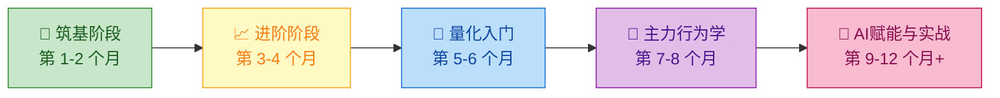

# 🗺️ 学习路线图 — 从小白到AI赋能量化操盘手的进阶之路 (v2)

> **"千里之行，始于足下。"** 本路线图将帮助你在 12 个月内，从零基础成长为具备独立开发、运行量化交易策略，并能熟练运用 AI Agent 辅助决策的操盘手。

---

## 📋 总览

---

## 🧱 第一阶段：筑基（第 1-2 个月）

**目标**：建立对金融市场的基本认知，能独立分析基本面。
- **核心章节**：`01-股票市场基础`，`02-基本面分析`
- **关键技能**：看懂 K 线、读懂三大财报、理解PE/PB估值体系、熟悉A股T+1等交易规则。

## 📈 第二阶段：进阶（第 3-4 个月）

**目标**：掌握技术分析体系与交易心理。
- **核心章节**：`03-技术分析`，`06-交易心理学`
- **关键技能**：均线系统、量价关系、MACD等指标运用，克服追涨杀跌的情绪化交易。

## 🤖 第三阶段：量化入门（第 5-6 个月）

**目标**：具备策略开发与回测能力。
- **核心章节**：`04-量化交易入门`
- **关键技能**：Python 基础、数据处理（Pandas）、使用聚宽等平台编写简单策略、规避回测陷阱。

## 🦈 第四阶段：主力行为与实战案例（第 7-8 个月）⭐ 新增

**目标**：认清市场博弈本质，知己知彼，制定跟庄策略。
- **核心章节**：
  - `07-A股实战案例分析`：深度学习德隆系、徐翔案等经典庄股案例及板块轮动规律。
  - `08-庄家行为学与主力分析`：理解国家队、公募、游资的手法，掌握看龙虎榜、资金流向、筹码分布的实战技巧。
- **防雷清单**：熟记并避开散户最常见的亏损模式（追高、频繁交易、打板失败等）。

## 🧠 第五阶段：AI 赋能与体系大成（第 9-12 个月+）⭐ 新增

**目标**：利用现代 AI 工具武装自己，建立自动化信息获取与决策风控工作流。
- **核心章节**：
  - `09-AI-Agent炒股实战指南`
  - `05-风险管理`（结合AI进行自动化风控）
- **关键实践**：
  1. 学会使用 LLM（Claude/GPT）编写高级 Prompt 分析研报和异动。
  2. 基于 GitHub Actions 和开源项目（如 daily_stock_analysis）部署免费的盘后自动化复盘与推送系统。
  3. 设计属于自己的多 Agent 协作流：让数据清洗、基本面研判、情绪评分和风控预警各司其职。
  4. 建立严格的仓位管理与止损纪律，实现稳定盈利。

---

## 🏆 终极里程碑

完成全阶段学习后，你将拥有：
- [x] 一套经过市场与历史回测验证的**量化交易规则**。
- [x] 一个每天自动为你搜集、清洗数据并生成分析报告的 **AI 助理团队**。
- [x] 一双能看透 K 线背后**主力资金运作意图**的火眼金睛。
- [x] 极其稳定的**交易心态与纪律**。

> **祝你在充满惊涛骇浪的 A 股市场中，乘风破浪，稳定盈利！**
