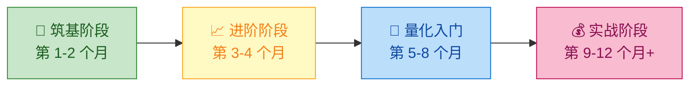

# 🗺️ 学习路线图 — 从小白到量化操盘手的进阶之路

> **"千里之行，始于足下。"** 本路线图将帮助你在 12 个月内，从零基础成长为具备独立开发和运行量化交易策略能力的操盘手。

---

## 📋 总览



| 阶段 | 时间 | 核心目标 | 关键技能 |
|:---:|:---:|:---|:---|
| 🧱 筑基 | 第 1-2 月 | 建立金融认知基础 | 看懂 K 线、读懂财报 |
| 📈 进阶 | 第 3-4 月 | 掌握技术分析体系 | 技术指标运用、模拟交易 |
| 🤖 量化入门 | 第 5-8 月 | 具备策略开发能力 | Python 编程、策略回测 |
| 💰 实战 | 第 9-12 月+ | 实现稳定交易系统 | 实盘操作、风控管理 |

---

## 🧱 第一阶段：筑基（第 1-2 个月）

### 🎯 学习目标

> 建立对金融市场的基本认知，理解股票交易的底层逻辑，能够独立分析上市公司基本面。

**具体目标：**

1. 理解 A 股市场的交易制度（T+1、涨跌幅限制、集合竞价等）
2. 掌握 K 线图的基本含义与常见形态
3. 学会阅读上市公司三大财务报表（资产负债表、利润表、现金流量表）
4. 理解常见估值指标（PE、PB、ROE、股息率）
5. 建立行业分析的基本框架
6. 开通证券账户，熟悉至少一款交易软件

### 📚 推荐学习资源

| 类型 | 资源名称 | 说明 | 优先级 |
|:---|:---|:---|:---:|
| 📖 书籍 | 《股票作手回忆录》 | 经典中的经典，理解市场心理 | ⭐⭐⭐ |
| 📖 书籍 | 《手把手教你读财报》（唐朝） | 最适合零基础的财报入门书 | ⭐⭐⭐⭐⭐ |
| 📖 书籍 | 《聪明的投资者》（格雷厄姆） | 价值投资圣经 | ⭐⭐⭐⭐ |
| 🌐 网站 | 东方财富网 | 行情数据、财报查询 | ⭐⭐⭐⭐ |
| 🌐 网站 | 巨潮资讯网 | 上市公司公告原文 | ⭐⭐⭐ |
| 📺 视频 | B站"半佛仙人"财经科普 | 轻松有趣的财经入门 | ⭐⭐⭐ |
| 📺 视频 | B站"巫师财经"系列 | 深度财经分析 | ⭐⭐⭐ |
| 🛠️ 工具 | 同花顺（PC/手机） | 国内主流交易软件 | ⭐⭐⭐⭐⭐ |

### 🏆 里程碑检查

完成筑基阶段后，你应该能够：

- [ ] 独立解释 T+1、涨跌停、集合竞价等 A 股基本制度
- [ ] 看到一根 K 线，能说出其含义（开盘价、收盘价、最高价、最低价）
- [ ] 随机选一家上市公司，能在 30 分钟内完成基本面初步评估
- [ ] 正确计算并解读 PE（市盈率）和 PB（市净率）
- [ ] 使用交易软件查看实时行情和历史走势
- [ ] 用自己的话向朋友解释"为什么股票会涨跌"

### ✅ 技能清单

```
基础概念
├── [ ] 理解股票的本质（公司所有权份额）
├── [ ] 了解 A 股交易时间与规则
├── [ ] 掌握 K 线图基本构成
├── [ ] 理解成交量的含义
└── [ ] 了解主要指数（上证、深证、创业板、科创板）

财务分析
├── [ ] 能阅读资产负债表
├── [ ] 能阅读利润表
├── [ ] 能阅读现金流量表
├── [ ] 计算并理解 PE（市盈率）
├── [ ] 计算并理解 PB（市净率）
├── [ ] 理解 ROE（净资产收益率）
└── [ ] 了解 DCF 估值模型的基本概念

工具使用
├── [ ] 开通证券账户
├── [ ] 安装并熟悉同花顺/通达信
├── [ ] 学会使用东方财富查财报
└── [ ] 建立个人学习笔记体系
```

---

## 📈 第二阶段：进阶（第 3-4 个月）

### 🎯 学习目标

> 掌握技术分析的核心理论与工具，通过模拟交易将理论知识转化为实战能力。

**具体目标：**

1. 理解道氏理论、支撑与阻力、趋势线等基础概念
2. 熟练运用 MACD、KDJ、RSI、布林带等主流技术指标
3. 识别经典图表形态（头肩顶/底、双顶/底、三角形整理等）
4. 理解量价关系及其在交易决策中的应用
5. 在模拟账户中进行至少 50 笔交易
6. 建立初步的交易纪律和交易日志习惯

### 📚 推荐学习资源

| 类型 | 资源名称 | 说明 | 优先级 |
|:---|:---|:---|:---:|
| 📖 书籍 | 《日本蜡烛图技术》（史蒂夫·尼森） | K 线分析权威著作 | ⭐⭐⭐⭐⭐ |
| 📖 书籍 | 《技术分析》（墨菲） | 技术分析"圣经" | ⭐⭐⭐⭐⭐ |
| 📖 书籍 | 《海龟交易法则》 | 经典趋势跟踪策略 | ⭐⭐⭐⭐ |
| 📖 书籍 | 《缠中说禅》 | 国内独创的技术分析体系 | ⭐⭐⭐ |
| 🌐 平台 | 同花顺模拟交易 | 免费模拟交易平台 | ⭐⭐⭐⭐⭐ |
| 🌐 平台 | 雪球组合 | 虚拟组合跟踪收益 | ⭐⭐⭐⭐ |
| 📺 视频 | B站技术分析系列教程 | 可视化学习技术指标 | ⭐⭐⭐⭐ |

### 🏆 里程碑检查

完成进阶阶段后，你应该能够：

- [ ] 在图表上准确画出趋势线、支撑位和阻力位
- [ ] 看到一张 K 线图，能在 5 分钟内给出技术分析观点
- [ ] 解释 MACD 金叉/死叉的含义及其局限性
- [ ] 模拟交易胜率达到 40% 以上（重点是学习，非盈利）
- [ ] 坚持记录交易日志至少 30 天
- [ ] 总结出自己的 3 条交易纪律

### ✅ 技能清单

```
技术分析基础
├── [ ] 理解道氏理论（趋势的三种类型）
├── [ ] 掌握支撑位与阻力位的判定
├── [ ] 学会绘制趋势线
└── [ ] 理解均线系统（MA5, MA10, MA20, MA60）

技术指标
├── [ ] MACD 的原理与应用
├── [ ] KDJ 的原理与应用
├── [ ] RSI 的原理与应用
├── [ ] 布林带（BOLL）的原理与应用
├── [ ] 成交量指标（VOL, OBV）
└── [ ] 理解指标的钝化与背离

图表形态
├── [ ] 头肩顶/头肩底
├── [ ] 双顶（M顶）/双底（W底）
├── [ ] 三角形整理（上升/下降/对称）
├── [ ] 旗形与楔形
└── [ ] 缺口理论（突破缺口/持续缺口/衰竭缺口）

交易实践
├── [ ] 开始模拟交易（至少 50 笔）
├── [ ] 建立交易日志模板
├── [ ] 制定个人交易纪律
├── [ ] 学会设定止损和止盈
└── [ ] 计算简单的盈亏比
```

---

## 🤖 第三阶段：量化入门（第 5-8 个月）

### 🎯 学习目标

> 掌握 Python 编程基础，学会获取和分析金融数据，能够独立开发、回测和评估量化交易策略。

**具体目标：**

1. 掌握 Python 基础语法、数据结构与面向对象编程
2. 熟练使用 Pandas、NumPy 进行数据处理与统计分析
3. 学会使用 Tushare/AKShare 等工具获取 A 股历史数据
4. 使用 Matplotlib/Plotly 进行金融数据可视化
5. 理解经典量化策略的数学原理
6. 使用 Backtrader 框架完成至少 3 个策略的回测
7. 掌握策略评估指标（年化收益率、夏普比率、最大回撤、胜率等）

### 📚 推荐学习资源

| 类型 | 资源名称 | 说明 | 优先级 |
|:---|:---|:---|:---:|
| 📖 书籍 | 《Python编程：从入门到实践》 | Python 零基础入门首选 | ⭐⭐⭐⭐⭐ |
| 📖 书籍 | 《利用Python进行数据分析》（Wes McKinney） | Pandas 作者亲著 | ⭐⭐⭐⭐⭐ |
| 📖 书籍 | 《打开量化投资的黑箱》 | 量化投资思维入门 | ⭐⭐⭐⭐ |
| 📖 书籍 | 《Python与量化投资》 | 结合 Python 和量化策略 | ⭐⭐⭐⭐ |
| 📖 书籍 | 《量化投资：策略与技术》（丁鹏） | 国内量化投资教材 | ⭐⭐⭐⭐ |
| 🌐 平台 | Tushare Pro | 专业 A 股数据接口 | ⭐⭐⭐⭐⭐ |
| 🌐 平台 | AKShare | 开源金融数据接口 | ⭐⭐⭐⭐ |
| 🌐 平台 | JoinQuant（聚宽） | 量化策略开发平台 | ⭐⭐⭐⭐ |
| 🌐 平台 | RiceQuant（米筐） | 量化研究与回测 | ⭐⭐⭐⭐ |
| 🛠️ 框架 | Backtrader | Python 回测框架 | ⭐⭐⭐⭐⭐ |
| 🛠️ 工具 | Jupyter Notebook | 交互式编程环境 | ⭐⭐⭐⭐⭐ |

### 🏆 里程碑检查

完成量化入门阶段后，你应该能够：

- [ ] 用 Python 脚本自动获取任意股票的历史数据
- [ ] 对股票数据进行清洗、处理和统计分析
- [ ] 绘制专业的 K 线图和技术指标叠加图
- [ ] 独立实现双均线交叉策略并完成回测
- [ ] 独立实现动量策略并完成回测
- [ ] 独立实现简单的多因子选股策略
- [ ] 正确解读回测报告中的各项指标
- [ ] 能够识别策略中的过拟合问题

### ✅ 技能清单

```
Python 基础
├── [ ] 变量、数据类型、运算符
├── [ ] 条件语句、循环语句
├── [ ] 函数定义与调用
├── [ ] 列表、字典、元组操作
├── [ ] 文件读写操作
├── [ ] 面向对象编程基础（类与对象）
├── [ ] 异常处理（try/except）
└── [ ] 模块与包的使用

数据科学工具
├── [ ] NumPy 数组操作与数学计算
├── [ ] Pandas DataFrame 操作
│   ├── [ ] 数据读取与写入（CSV, Excel）
│   ├── [ ] 数据筛选与过滤
│   ├── [ ] 数据聚合与分组（groupby）
│   ├── [ ] 时间序列处理
│   └── [ ] 数据合并（merge, concat）
├── [ ] Matplotlib 基础绑图
├── [ ] Plotly 交互式图表
└── [ ] Jupyter Notebook 使用

金融数据获取
├── [ ] Tushare Pro API 使用
├── [ ] AKShare 数据获取
├── [ ] 数据清洗与预处理
└── [ ] 构建本地数据仓库

量化策略
├── [ ] 均线交叉策略（Golden Cross / Death Cross）
├── [ ] 动量策略（Momentum）
├── [ ] 均值回归策略（Mean Reversion）
├── [ ] 多因子选股模型
├── [ ] Backtrader 框架使用
│   ├── [ ] 数据加载
│   ├── [ ] 策略编写
│   ├── [ ] 执行回测
│   └── [ ] 结果分析
└── [ ] 策略评估指标
    ├── [ ] 年化收益率
    ├── [ ] 夏普比率（Sharpe Ratio）
    ├── [ ] 最大回撤（Max Drawdown）
    ├── [ ] 胜率（Win Rate）
    └── [ ] 盈亏比（Profit/Loss Ratio）
```

---

## 💰 第四阶段：实战（第 9-12 个月+）

### 🎯 学习目标

> 将经过回测验证的策略投入小资金实盘运行，建立完整的风险控制体系，持续迭代优化交易系统。

**具体目标：**

1. 选择 1-2 个经过充分回测的策略投入实盘
2. 建立完整的仓位管理和资金管理体系
3. 设定严格的止损规则并坚决执行
4. 控制单笔交易风险在总资金的 1-2% 以内
5. 持续记录交易日志，定期复盘
6. 根据实盘数据迭代优化策略
7. 关注市场宏观环境对策略的影响

### 📚 推荐学习资源

| 类型 | 资源名称 | 说明 | 优先级 |
|:---|:---|:---|:---:|
| 📖 书籍 | 《交易心理分析》（马克·道格拉斯） | 交易心理学经典 | ⭐⭐⭐⭐⭐ |
| 📖 书籍 | 《通往财务自由之路》（范·撒普） | 系统化交易方法论 | ⭐⭐⭐⭐⭐ |
| 📖 书籍 | 《资金管理方法及其应用》 | 仓位管理核心参考 | ⭐⭐⭐⭐ |
| 📖 书籍 | 《算法交易：制胜策略与原理》 | 高阶策略设计 | ⭐⭐⭐⭐ |
| 📖 书籍 | 《黑天鹅》（塔勒布） | 理解极端风险 | ⭐⭐⭐⭐ |
| 🌐 社区 | 雪球/集思录 | 投资社区交流 | ⭐⭐⭐⭐ |
| 🌐 社区 | QuantConnect | 全球量化社区 | ⭐⭐⭐ |

### 🏆 里程碑检查

完成实战阶段后，你应该能够：

- [ ] 至少有一个策略实盘运行超过 3 个月
- [ ] 实盘最大回撤控制在 15% 以内
- [ ] 建立了完整的交易复盘体系（每周 + 每月）
- [ ] 能够根据市场环境切换或调整策略
- [ ] 建立了个人的风险管理检查清单
- [ ] 能保持情绪稳定，严格执行交易纪律
- [ ] 形成了自己的交易哲学和风格

### ✅ 技能清单

```
资金管理
├── [ ] 制定初始资金规模（建议 5-10 万起步）
├── [ ] 单笔交易风险控制（不超过总资金 1-2%）
├── [ ] 仓位管理模型（固定比例 / 凯利公式）
├── [ ] 分散投资（不同行业、不同策略）
└── [ ] 资金曲线监控

风险控制
├── [ ] 设定最大日亏损限制
├── [ ] 设定最大周/月亏损限制
├── [ ] 制定极端行情应对预案
├── [ ] 设定策略失效标准（何时停止策略）
└── [ ] 黑天鹅事件防范

交易执行
├── [ ] 策略信号到下单的标准流程
├── [ ] 止损止盈的严格执行
├── [ ] 交易日志的每日记录
├── [ ] 每周交易复盘
└── [ ] 每月绩效评估

心理建设
├── [ ] 接受亏损是交易的一部分
├── [ ] 避免过度交易（overtrading）
├── [ ] 克服 FOMO（错失恐惧症）
├── [ ] 保持耐心，等待高概率机会
└── [ ] 建立交易之外的生活平衡
```

---

## 📖 推荐书目总览

按学习阶段分类，精选最值得阅读的书籍：

### 🧱 筑基阶段

| 序号 | 书名 | 作者 | 核心价值 | 难度 |
|:---:|:---|:---|:---|:---:|
| 1 | 《手把手教你读财报》 | 唐朝 | 零基础财报入门 | ⭐ |
| 2 | 《股票作手回忆录》 | 埃德温·勒菲弗 | 理解市场与人性 | ⭐⭐ |
| 3 | 《聪明的投资者》 | 本杰明·格雷厄姆 | 价值投资哲学 | ⭐⭐⭐ |
| 4 | 《漫步华尔街》 | 伯顿·马尔基尔 | 投资理论全景 | ⭐⭐ |

### 📈 进阶阶段

| 序号 | 书名 | 作者 | 核心价值 | 难度 |
|:---:|:---|:---|:---|:---:|
| 5 | 《日本蜡烛图技术》 | 史蒂夫·尼森 | K 线分析权威 | ⭐⭐ |
| 6 | 《技术分析（第五版）》 | 约翰·墨菲 | 技术分析百科全书 | ⭐⭐⭐ |
| 7 | 《海龟交易法则》 | 柯蒂斯·费思 | 趋势跟踪经典 | ⭐⭐ |
| 8 | 《炒股的智慧》 | 陈江挺 | 实战经验总结 | ⭐⭐ |

### 🤖 量化阶段

| 序号 | 书名 | 作者 | 核心价值 | 难度 |
|:---:|:---|:---|:---|:---:|
| 9 | 《Python编程：从入门到实践》 | 埃里克·马瑟斯 | Python 入门首选 | ⭐ |
| 10 | 《利用Python进行数据分析》 | Wes McKinney | Pandas 权威指南 | ⭐⭐⭐ |
| 11 | 《打开量化投资的黑箱》 | 里什·纳兰 | 量化思维入门 | ⭐⭐⭐ |
| 12 | 《量化投资：策略与技术》 | 丁鹏 | A 股量化实践 | ⭐⭐⭐⭐ |

### 💰 实战阶段

| 序号 | 书名 | 作者 | 核心价值 | 难度 |
|:---:|:---|:---|:---|:---:|
| 13 | 《交易心理分析》 | 马克·道格拉斯 | 交易心理必读 | ⭐⭐⭐ |
| 14 | 《通往财务自由之路》 | 范·撒普 | 系统化交易 | ⭐⭐⭐⭐ |
| 15 | 《黑天鹅》 | 纳西姆·塔勒布 | 极端风险认知 | ⭐⭐⭐ |
| 16 | 《算法交易》 | 欧内斯特·陈 | 高阶策略设计 | ⭐⭐⭐⭐⭐ |

---

## 🌐 推荐在线资源与工具

### 数据平台

| 平台 | 网址 | 说明 | 免费/付费 |
|:---|:---|:---|:---:|
| Tushare Pro | tushare.pro | A 股全量数据 API | 基础免费 |
| AKShare | akshare.xyz | 开源金融数据库 | 免费 |
| 东方财富 | eastmoney.com | 行情 + 资讯 + 财报 | 免费 |
| 巨潮资讯 | cninfo.com.cn | 上市公司公告 | 免费 |
| Wind（万得） | wind.com.cn | 专业金融终端 | 付费 |

### 量化平台

| 平台 | 网址 | 说明 | 免费/付费 |
|:---|:---|:---|:---:|
| 聚宽（JoinQuant） | joinquant.com | 在线策略开发与回测 | 基础免费 |
| 米筐（RiceQuant） | ricequant.com | 量化研究平台 | 基础免费 |
| 优矿（Uqer） | uqer.datayes.com | 量化投资平台 | 基础免费 |
| QuantConnect | quantconnect.com | 国际量化平台 | 基础免费 |

### 编程工具

| 工具 | 说明 | 推荐理由 |
|:---|:---|:---|
| VS Code | 代码编辑器 | 轻量、插件丰富、免费 |
| Jupyter Notebook | 交互式编程 | 适合数据分析与实验 |
| Anaconda | Python 环境管理 | 自带科学计算库，省心 |
| Git / GitHub | 版本控制 | 管理策略代码版本 |

### 学习社区

| 社区 | 说明 |
|:---|:---|
| 雪球（xueqiu.com） | 国内最大投资社区 |
| 集思录（jisilu.cn） | 低风险投资策略社区 |
| 知乎量化专栏 | 量化投资讨论 |
| GitHub | 开源量化项目 |

---

## 🗓️ 每周学习时间规划

> [!TIP]
> 以下时间规划基于**每周 10 小时**的投入。可根据个人情况灵活调整，但建议**每天至少投入 1 小时**，保持学习连贯性。

### 筑基阶段（第 1-2 月）— 每周 8-10 小时

| 时间段 | 周一 | 周二 | 周三 | 周四 | 周五 | 周末 |
|:---:|:---:|:---:|:---:|:---:|:---:|:---:|
| 学习内容 | 📘 交易制度 | 📘 K 线基础 | 📗 财报阅读 | 📗 估值方法 | 📝 复习总结 | 📖 阅读书籍 |
| 时长 | 1.5h | 1.5h | 1.5h | 1.5h | 1h | 3h |

### 进阶阶段（第 3-4 月）— 每周 8-10 小时

| 时间段 | 周一 | 周二 | 周三 | 周四 | 周五 | 周末 |
|:---:|:---:|:---:|:---:|:---:|:---:|:---:|
| 学习内容 | 📙 技术指标 | 📙 图表形态 | 🎮 模拟交易 | 📙 量价分析 | 🎮 模拟交易 | 📝 复盘+书籍 |
| 时长 | 1.5h | 1.5h | 1.5h | 1.5h | 1h | 3h |

### 量化阶段（第 5-8 月）— 每周 10-15 小时

| 时间段 | 周一 | 周二 | 周三 | 周四 | 周五 | 周末 |
|:---:|:---:|:---:|:---:|:---:|:---:|:---:|
| 学习内容 | 🐍 Python | 🐍 Pandas | 📊 数据分析 | 🤖 策略开发 | 🤖 回测调试 | 📝 项目+书籍 |
| 时长 | 2h | 2h | 2h | 2h | 1.5h | 4h |

### 实战阶段（第 9-12 月）— 每周 10-15 小时

| 时间段 | 周一 | 周二 | 周三 | 周四 | 周五 | 周末 |
|:---:|:---:|:---:|:---:|:---:|:---:|:---:|
| 学习内容 | 📊 盯盘+记录 | 📊 盯盘+记录 | 🔧 策略优化 | 📊 盯盘+记录 | 📊 盯盘+记录 | 📝 复盘+迭代 |
| 时长 | 2h | 2h | 2h | 2h | 1.5h | 4h |

---

## 📊 学习进度追踪

使用以下表格追踪你的整体学习进度：

| 阶段 | 开始日期 | 目标完成日期 | 实际完成日期 | 完成度 | 备注 |
|:---|:---:|:---:|:---:|:---:|:---|
| 🧱 筑基阶段 | ____/____ | ____/____ | ____/____ | ___% | |
| 📈 进阶阶段 | ____/____ | ____/____ | ____/____ | ___% | |
| 🤖 量化入门 | ____/____ | ____/____ | ____/____ | ___% | |
| 💰 实战阶段 | ____/____ | ____/____ | ____/____ | ___% | |

---

## ❓ 常见问题 FAQ

### Q1：我完全是零基础，真的能学会量化交易吗？

> **A：** 当然可以！本路线图就是为零基础学习者设计的。关键在于：
> 1. **按顺序学习**，不要跳过基础阶段
> 2. **保持耐心**，这是一个需要 12 个月以上持续投入的过程
> 3. **多实践**，边学边做，不要只看不练

### Q2：需要数学或编程基础吗？

> **A：** 不需要高深的数学基础。高中数学水平足够应对前三个阶段。编程方面，Python 是最友好的入门语言之一，从零开始学起完全没问题。到了量化阶段，你需要理解一些统计学概念（均值、方差、相关性），但不需要推导公式。

### Q3：需要多少初始资金？

> **A：** 前 8 个月（前三个阶段）**不需要任何资金**，只需用模拟盘练习。进入实战阶段后，建议准备 **5-10 万元**作为初始资金。这笔钱应该是你的**闲余资金**，即便全部亏损也不影响生活。

### Q4：每天需要投入多少时间？

> **A：** 建议每天至少投入 **1-2 小时**。周末可以多花一些时间阅读和复盘。关键不在于每天学多久，而在于**持续性和专注度**。碎片化学习效果很差，建议找固定的时间段集中学习。

### Q5：量化交易一定能赚钱吗？

> **A：** **不能保证。** 量化交易的优势在于纪律性和可回测性，但任何策略都有失效的可能。市场是动态变化的，没有永远有效的策略。你的目标应该是建立一个**概率优势系统**，长期下来获得正期望值的收益。同时，严格的风控是保证生存的关键。

### Q6：A 股适合做量化交易吗？

> **A：** A 股市场有其独特性（T+1、涨跌停、散户比例高等），这些因素反而为量化策略提供了独特的机会。许多在成熟市场已失效的简单策略，在 A 股市场仍然有效。关键是要理解 A 股市场的微观结构，并针对性地设计策略。

### Q7：学了这些之后，应该做全职交易吗？

> **A：** **强烈不建议**在学习阶段辞职做全职交易。建议：
> 1. 前 1-2 年保持本职工作，利用业余时间学习和交易
> 2. 只有当你的策略在实盘中持续盈利超过 2 年，且收益能覆盖生活开支时，才考虑全职
> 3. 即便全职交易，也要保持收入来源的多元化

### Q8：推荐的学习顺序是什么？

> **A：** 严格按照本路线图的四个阶段顺序学习：
> ```
> 筑基 → 进阶 → 量化入门 → 实战
> ```
> 不要跳过任何阶段。每个阶段的里程碑检查全部通过后，再进入下一阶段。基础不牢，地动山摇。

---

## 🔄 完整学习路径图

```mermaid
graph TD
    START["🚀 开始你的量化之旅"] --> A1

    subgraph PHASE1["🧱 筑基阶段 · 第 1-2 个月"]
        A1["了解 A 股交易制度"] --> A2["学习 K 线基础"]
        A2 --> A3["阅读财务报表"]
        A3 --> A4["掌握估值方法"]
        A4 --> A5["开通证券账户"]
    end

    A5 --> CHECK1{"✅ 筑基里程碑<br/>全部通过？"}
    CHECK1 -- "是" --> B1
    CHECK1 -- "否" --> A1

    subgraph PHASE2["📈 进阶阶段 · 第 3-4 个月"]
        B1["学习道氏理论"] --> B2["掌握技术指标"]
        B2 --> B3["识别图表形态"]
        B3 --> B4["理解量价关系"]
        B4 --> B5["开始模拟交易"]
        B5 --> B6["建立交易日志"]
    end

    B6 --> CHECK2{"✅ 进阶里程碑<br/>全部通过？"}
    CHECK2 -- "是" --> C1
    CHECK2 -- "否" --> B1

    subgraph PHASE3["🤖 量化入门 · 第 5-8 个月"]
        C1["Python 基础"] --> C2["Pandas / NumPy"]
        C2 --> C3["金融数据获取"]
        C3 --> C4["数据可视化"]
        C4 --> C5["均线策略回测"]
        C5 --> C6["动量策略回测"]
        C6 --> C7["多因子模型"]
    end

    C7 --> CHECK3{"✅ 量化里程碑<br/>全部通过？"}
    CHECK3 -- "是" --> D1
    CHECK3 -- "否" --> C1

    subgraph PHASE4["💰 实战阶段 · 第 9-12 个月+"]
        D1["选择实盘策略"] --> D2["小资金试运行"]
        D2 --> D3["建立风控体系"]
        D3 --> D4["交易执行与记录"]
        D4 --> D5["定期复盘优化"]
        D5 --> D6["策略迭代升级"]
    end

    D6 --> GOAL["🏆 建立稳定的量化交易系统"]

    style START fill:#667eea,stroke:#764ba2,color:#fff
    style GOAL fill:#f093fb,stroke:#f5576c,color:#fff
    style PHASE1 fill:#e8f5e9,stroke:#4caf50
    style PHASE2 fill:#fff3e0,stroke:#ff9800
    style PHASE3 fill:#e3f2fd,stroke:#2196f3
    style PHASE4 fill:#fce4ec,stroke:#e91e63
    style CHECK1 fill:#fff9c4,stroke:#fbc02d
    style CHECK2 fill:#fff9c4,stroke:#fbc02d
    style CHECK3 fill:#fff9c4,stroke:#fbc02d
```



---

## 💡 最后的话

> [!IMPORTANT]
> 量化交易不是"一夜暴富"的捷径，而是一门需要**持续学习、严格纪律和耐心打磨**的技艺。
>
> 在这条路上，你会经历：
> - 📚 **枯燥的学习期**：大量的理论知识需要消化
> - 😤 **挫败的调试期**：代码报错、策略失败是家常便饭
> - 💸 **痛苦的亏损期**：实盘亏损会考验你的心理承受力
> - 🌟 **顿悟的突破期**：当一切开始连通，你会感受到量化的魅力
>
> **坚持下去，时间会给你答案。**

---

> **📌 导航**
> - [← 返回项目首页](../README.md)
> - [→ 模块一：股票市场基础](01-股票市场基础/)

---

<p align="center">
  <em>"在投资中，真正的优势不是信息，而是纪律。"</em><br/>
  <sub>— 改编自 Howard Marks</sub>
</p>
