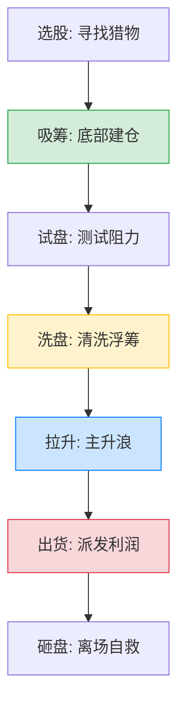

# 📈 庄家操盘全流程解析 — 看透K线背后的阴谋与阳谋

> *"庄家就像是躲在暗处的猎手，K线和成交量就是他在雪地上留下的脚印。读懂这些脚印，你就能与狼共舞。"*

庄家从介入一只股票到最终获利离场，通常需要经过**选股、吸筹、试盘、洗盘、拉升、出货、砸盘**的完整闭环。本章将为你剥茧抽丝，深度解析每一个阶段的盘口特征。

---

## 庄家操盘全生命周期

---

## 1. 选股阶段：猎物的锁定

**庄家的选股标准**：
- **流通盘适中**：太大（如银行）控不住盘，太小（如几千万流通盘）容纳不下巨额资金。30-100亿流通市值的个股最受青睐。
- **有故事可讲**：必须契合未来的国家政策、产业趋势，或者有并购重组预期，这样拉升时才有散户愿意跟风接盘。
- **基本面干净**：无退市风险，无大股东清仓式减持计划（庄家最怕拉升时被大股东暗算砸盘）。

## 2. 吸筹阶段（建仓）：漫长的潜伏

这是庄家最需要耐心的阶段，核心目的是在尽量不惊动市场的情况下，低价买入足够多的筹码。

### 🔹 横盘吸筹（时间换空间）
- **手法**：将股价控制在一个狭窄的箱体内，长期（数月甚至半年）横盘，用枯燥的走势磨掉散户的耐心。
- **量价特征**：**“红肥绿瘦”**。上涨的阳线带有微小放量（庄家在买），下跌的阴线极度缩量（散户在熬）。
- **散户应对**：这种阶段极度熬人，散户**不要过早介入**，应将其加入自选股，等待放量突破箱体上沿时再上车。

### 🔹 打压吸筹（带血的筹码）
- **手法**：借大盘暴跌或个股突发利空（有时是庄家联合上市公司故意释放的），用手中已有筹码疯狂砸盘，制造恐慌。
- **特征**：股价出现断崖式下跌，散户恐慌割肉，庄家在底部张开大网接单。
- **散户应对**：突发利空导致的暴跌，若底部伴随极其夸张的巨量，往往是庄家在接盘。

### 🔹 拉高吸筹（急性子庄家）
- **手法**：遇到突发重大利好，庄家来不及低位建仓，只能通过连续拉高，让上方的套牢盘解套抛出，从而收集筹码。

## 3. 试盘阶段：投石问路

- **目的**：测试上方的抛压（套牢盘多不多）和下方的支撑（有没有其他机构在抢筹）。
- **盘口特征**：在平静的盘面中，突然出现一笔大单将股价直线拉高数个百分点，或者直线砸下，随后股价迅速恢复原状。
- **K线形态**：日线图上留下**长长的上影线或下影线**，俗称“单针探底”或“仙人指路”。

## 4. 洗盘阶段：清洗不坚定的跟风者

庄家吸够筹码后，在主升浪到来前，必须把低位跟风的散户“洗”下车，以垫高散户的平均持仓成本，减轻后期拉升的抛压。

### 常见的残酷洗盘手法：
1. **挖坑洗盘**：在良好的上升趋势中，突然一根大阴线破位杀跌，甚至跌破20日均线，但在随后2-3天内迅速用大阳线收复失地。（技术派最容易死在这里）
2. **长上影线洗盘**：早盘急速拉高，随后全天震荡走低，收出一根难看的长上影线（假避雷针），制造主力出逃的假象。
3. **涨停板洗盘（烂板洗盘）**：封死涨停后，庄家故意撤单，让涨停板反复打开，散户以为封不住了纷纷卖出，尾盘庄家再一口气封死。

### 🚨 核心必修课：如何区分“洗盘”与“出货”？

| 对比维度 | 洗盘（主力还在） | 出货（主力逃跑） |
|:---|:---|:---|
| **位置** | 处于底部刚启动或拉升初期 | 处于股价已经翻倍的高位 |
| **成交量** | **下跌时极度缩量**（没人卖了） | **下跌时明显放量**（主力在疯狂倒货） |
| **关键均线** | 回踩20日或30日均线即获得强支撑 | 跌破重要均线，且反抽无力 |
| **盘口特征** | 往往在大跌时下方有大单托底 | 盘中急拉后缓慢阴跌，上方大单压盘 |
| **消息面** | 往往伴随利空消息或大盘环境差 | 往往伴随铺天盖地的研报和利好消息 |

## 5. 拉升阶段：狂欢的主升浪

- **特征**：一旦洗盘结束，主升浪往往极其猛烈。K线呈现**放量大阳线，均线呈完美的向上发散多头排列**。
- **盘口**：买一到买五挂单不大，但不断有隐形大单主动向上扫货。
- **散户应对**：这是最舒服的阶段。策略就是**“捂住”**，只要趋势没有跌破10日均线，就不要被盘中的小幅震荡吓出局。

## 6. 出货阶段：盛宴的终结

庄家赚钱的唯一方式，是把高位的筹码换成散户手里的现金。

### 典型的致命出货手法：
1. **高位横盘出货**：股价在高位构筑一个平台，利用各种利好消息维持热度，庄家在震荡中悄悄派发。
2. **拉高出货**：早盘急速拉高5%-8%，吸引眼球，随后全天在这一位置慢慢卖出，日K线收出放量长阳，次日低开闷杀。
3. **钓鱼线出货**：极度恶劣。分时图上股价直线拉升几乎涨停，停顿几分钟后，如同瀑布般直线砸向跌停，图形极像一根挂着鱼饵的鱼竿。

## 7. 砸盘阶段：一地鸡毛

- **特征**：庄家的大部分利润已经落袋，手中剩下少部分“零成本筹码”。为了彻底离场，庄家会不计成本地向下砸盘，股价出现毫无抵抗的连续大跌。
- **散户应对**：如果发现自己不幸在高位站岗，且跌破了最后的重要支撑位（如60日均线），**不要有任何幻想，无条件止损**。留得青山在，不怕没柴烧。

> **💡 交易座右铭**：
> "买入靠耐心（等吸筹完毕突破），持有靠信心（识别洗盘死拿），卖出靠决心（一旦发现出货信号，果断离场不留恋）。"
