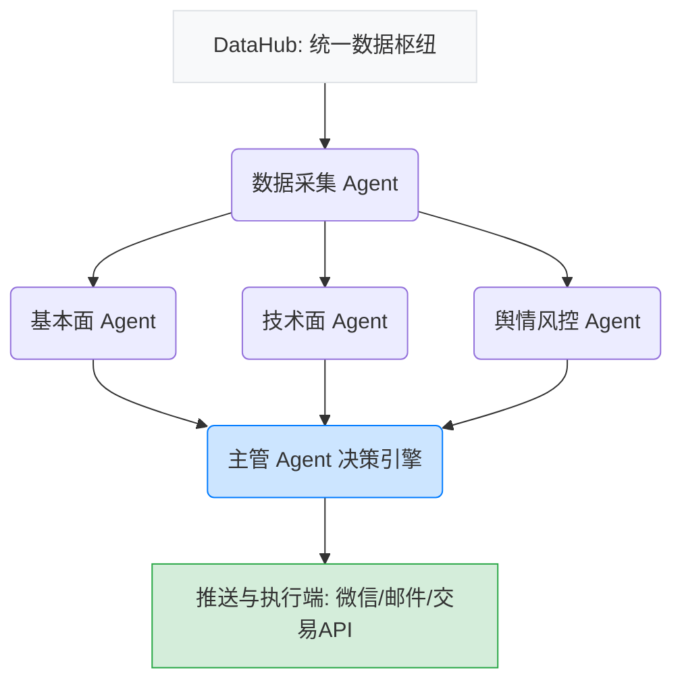

# ⚙️ AI-Agent量化分析工作流 — 打造你的私人交易团队

> *"不要试图写一个无所不能的神级程序。组建一支各司其职的 AI Agent 团队，让它们协作完成复杂的投资研究。"*

本章将提供一套**可直接复用**的 Multi-Agent（多智能体）架构设计，并包含核心 Prompt 模板，帮助你构建属于自己的 AI 交易研究团队。

---

## 1. Multi-Agent 协作架构设计

我们将投资研究拆解为 5 个核心环节，分别交给 5 个专门的 AI Agent，并由一个“主管 Agent”进行汇总。



---

## 2. 数据采集 Agent：团队的“情报员”

- **职责**：定时获取准确无误的市场数据，清洗后喂给其他 Agent。
- **数据源方案**：**Tushare Pro + AkShare 双源架构**。
  - 优先调用 Tushare（数据稳定、接口规范，但需要积分）。
  - 若遇网络或权限错误，自动降级调用 AkShare（完全免费开源）。

### 💻 核心 Python 代码模板（数据获取）
```python
import akshare as ak
import pandas as pd
from datetime import datetime

def get_stock_data(stock_code="600519", start_date="20230101", end_date=None):
    """使用 AkShare 获取 A 股历史日线行情"""
    if not end_date:
        end_date = datetime.now().strftime("%Y%m%d")
    try:
        # 获取前复权数据
        df = ak.stock_zh_a_hist(symbol=stock_code, period="daily", start_date=start_date, end_date=end_date, adjust="qfq")
        df.rename(columns={'日期': 'date', '开盘': 'open', '收盘': 'close', 
                           '最高': 'high', '最低': 'low', '成交量': 'volume'}, inplace=True)
        return df[['date', 'open', 'high', 'low', 'close', 'volume']]
    except Exception as e:
        print(f"数据获取失败: {e}")
        return None
```

---

## 3. 基本面分析 Agent：团队的“财务总监”

- **职责**：阅读枯燥的财报数据，评估公司的护城河、估值水平和财务健康度。

### 💬 核心 Prompt 模板
```text
你是一位拥有20年经验的华尔街基本面分析师。请根据以下我提供的A股公司财务数据（JSON格式），进行深度分析。
请务必按照以下格式输出你的结论：
1. 【核心亮点】：公司当前最大的财务优势（如毛利率提升、现金流充沛等）。
2. 【隐患预警】：排雷分析（如应收账款激增、存货周转率下降、商誉过高等）。
3. 【估值评估】：结合当前的PE（市盈率）、PB（市净率）和历史分位，评估当前价格是低估、合理还是泡沫。
4. 【结论】：一句话总结是否具备中长线投资价值。

输入数据：[此处插入通过API获取的财务数据JSON]
```

---

## 4. 技术面分析 Agent：团队的“交易操盘手”

- **职责**：计算技术指标，识别K线形态，捕捉买卖点。

### 💻 核心 Python 代码模板（指标计算与买卖信号）
```python
import pandas as pd
import talib # 需要安装 TA-Lib 库

def generate_signals(df):
    """计算 MACD 和 RSI 并生成简单信号"""
    # 计算 MACD (12, 26, 9)
    df['macd'], df['macdsignal'], df['macdhist'] = talib.MACD(df['close'], fastperiod=12, slowperiod=26, signalperiod=9)
    # 计算 RSI (14)
    df['rsi'] = talib.RSI(df['close'], timeperiod=14)
    
    # 生成信号
    df['signal'] = 'WAIT'
    # 简单的金叉且RSI处于合理区间作为买入信号
    buy_condition = (df['macd'] > df['macdsignal']) & (df['macd'].shift(1) <= df['macdsignal'].shift(1)) & (df['rsi'] < 60)
    # 死叉或RSI超买作为卖出信号
    sell_condition = (df['macd'] < df['macdsignal']) & (df['macd'].shift(1) >= df['macdsignal'].shift(1)) | (df['rsi'] > 80)
    
    df.loc[buy_condition, 'signal'] = 'BUY'
    df.loc[sell_condition, 'signal'] = 'SELL'
    return df.tail(10)
```

### 💬 核心 Prompt 模板
```text
你是一位精通A股量价关系的技术分析大师。以下是某只股票最近10个交易日的K线数据及MACD、RSI指标状态。
请分析：
1. 当前处于什么趋势（上升/下降/震荡）？
2. 是否存在顶底背离、双底、头肩顶等经典形态？
3. 关键的支撑位和阻力位大约在哪里？
4. 给出短期（1-2周）的交易建议，并说明理由。
```

---

## 5. 舆情与风控 Agent：团队的“政委”

- **职责**：将非结构化的新闻转化为情绪得分，并时刻盯紧你的钱包（止损线）。

### 💬 情绪分析 Prompt 模板
```text
你是一个专业的金融情感分析模型。请阅读以下关于某上市公司的最新新闻摘要和股吧评论摘要。
任务：
1. 给出一个 0 到 100 的情绪得分（0=极度恐慌/重大利空，50=中性，100=极度狂热/重大利好）。
2. 列出排名前三的正面催化剂和负面风险。
3. 警惕“利好出尽”：如果利好已经被广泛讨论超过3天，请下调情绪得分并提示风险。
```

---

## 6. 完整的每日 AI 工作流推荐

为了将上述 Agent 运转起来，你需要编写一个 Python 调度脚本，实现每日自动化运行。

1. **盘前策略生成（08:00 - 09:15）**：
   - 触发定时任务。
   - 数据 Agent 拉取昨夜美股走势、A股宏观新闻、持仓股公告。
   - 舆情 Agent 进行情绪分析。
   - 主管 Agent 生成《今日盘前操作备忘录》，推送到你的微信/飞书。
2. **盘中风控监控（09:30 - 15:00）**：
   - 每隔 5 分钟轮询一次持仓股价格。
   - 一旦触发设定的止损线（如 -7%）或止盈线，风控 Agent 立即发送强警报（微信弹窗或邮件提醒）。
3. **盘后复盘总结（15:30 - 16:30）**：
   - 获取全天最终收盘数据。
   - 技术面 Agent 计算最新技术指标。
   - 基本面 Agent 检查是否有新的研报或财报发布。
   - 汇总生成《今日复盘与明日计划报告》。

> **💡 建议**：
> 不要一开始就尝试写出完美的框架。先跑通**“获取数据 → 用一段简单的 Prompt 分析 → 打印结果”**这个最简闭环。推荐使用 `GitHub Actions` 搭配开源的 `daily_stock_analysis` 仓库作为起步，这是散户零成本体验 AI 量化工作流的最佳方式。
