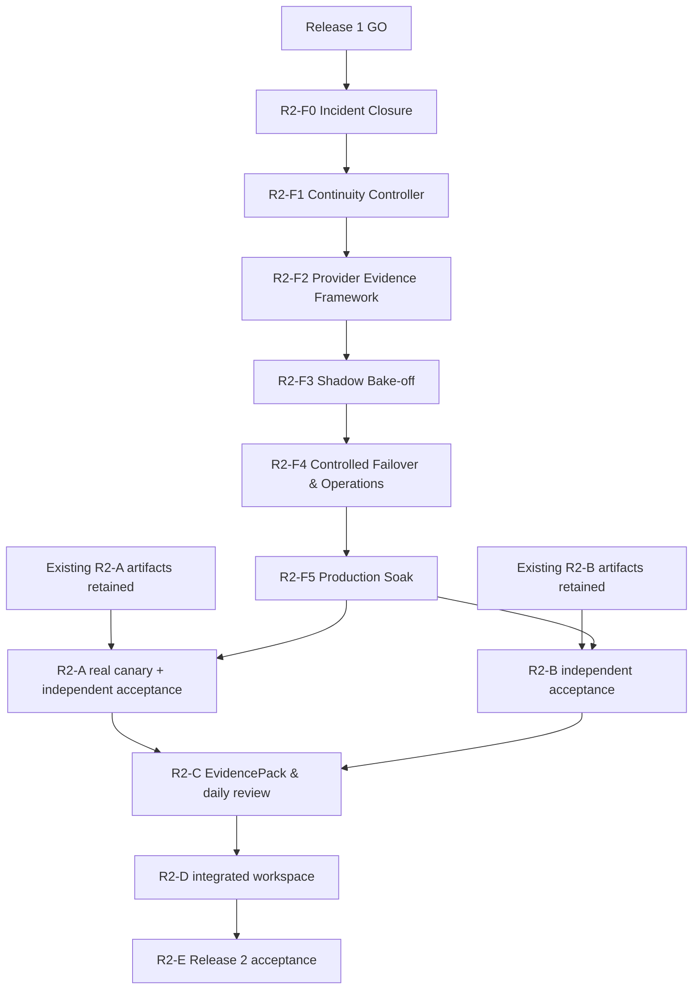

# Stock EVA R2-F Data Reliability Foundation Version Roadmap

**Author:** Codex root architecture lead  
**Date:** 2026-08-12 (Asia/Shanghai)  
**Status:** R2-F0.1 offline code gate complete; deployment and R2-F0 production gate remain closed

**Decision authority:** User approved the revised data-reliability priority on 2026-08-12  
**Scope:** R2-F0 through R2-F5  
**Detailed execution plan:**
`docs/plans/2026-08-12-stock-eva-r2f-data-reliability-implementation.md`

## 1. Decision and authority

R2-F is a new blocking foundation for Release 2. It changes the Release 2 implementation order,
but it does not erase completed work or rewrite old acceptance evidence.

- Preserve the current canonical chain:
  `Normalize -> Quality Gate -> Immutable Parquet -> SHA-256 -> Manifest -> Atomic Publish`.
- Close the active incident and automatic historical-gap recovery before adding automatic source
  switching.
- Introduce provider-neutral evidence and reconciliation before any secondary provider can publish
  canonical data.
- Run candidate providers in shadow mode before enabling whole-session failover.
- Retain the existing R2-A and R2-B code and acceptance records. Their current documents remain the
  authority for what was and was not verified.
- Freeze R2-C, R2-D and R2-E feature expansion until R2-F5 is GO and R2-A/R2-B have been
  independently re-accepted against the reliable-data foundation.
- This document supersedes only the Release 2 sequencing in
  `docs/plans/2026-07-29-stock-eva-roadmap-execution-plan.md`.

### 2026-08-13 status checkpoint

- R2-F0.1 provider transport stabilization is **OFFLINE CODE GO** only at exact code HEAD
  `b0b643fd78b1b0be27279cbd3380268577408c85`; see
  [its acceptance record](../acceptance/release-2-r2f0-1.md).
- This does not close the R2-F0 production incident. R2-F0 remains production NO-GO under
  [the incident record](../acceptance/release-2-r2f0.md).
- Installation, real provider canary, production refresh, NAS/pointer mutation and restoration of
  automatic refresh all require separate approval and fresh live-state evidence.
- The next code stage is **Gap Scanner + Health-aware Repair Queue**, only after explicit user
  confirmation. It precedes the provider-neutral RAW Evidence Framework and second-source work.
- Multi-provider failover stays disabled. A second source must first complete at least 20
  consecutive trading sessions of whole-session shadow qualification; symbol-level mixing remains
  prohibited, and failover requires a separately approved manual qualification/failover stage.

## 2. Verified baseline on 2026-08-12

The starting point is not a green production state.

- Git planning baseline: `main` at `cfcfeb6`; the installed runtime is a separate deployed
  release and must be re-read before each production step.
- All five LaunchAgents are loaded; the API, workspace and local immutable dataset report ready.
- The live market status reported:
  `latest_expected_session=2026-08-11`, `published_as_of=2026-08-10`,
  `refresh_state=delayed`.
- The last 2026-08-11 attempt fetched all 3,195 expected symbols but refused publication because
  `sh.600984` and `sh.603221` produced `invalid_suspended_placeholder`.
- The immediate contract mismatch is local and reproducible: suspended stock rows are allowed to
  omit activity/factor data, but normalization adds `missing_adjust_factor` while the publication
  gate accepts only the exact issue list `["suspended_placeholder"]`.
- The current scheduler follows the latest expected session and a finite retry schedule. It does
  not inventory all missing published trading sessions and does not maintain a repair queue.
- Existing full-history/backfill flows are explicit administrative workflows; the ordinary
  symbol backfill is bounded and is not a canonical full-universe repair controller.
- Core market response models constrain `source` to BaoStock, so adding a provider is a model,
  storage, API and manifest migration, not an isolated client change.
- Bundled exchange calendars currently cover 2025 and 2026. Unknown years already fail closed,
  but next-year acquisition is not yet an unattended, versioned operating process.
- The installed service reads the local dataset mirror. The NAS archive can seed the local mirror,
  but successful local publications are not yet placed in a durable outbound replication queue.
- R2-A says `INDEPENDENT RE-REVIEW REQUIRED` and explicitly says Release 2 is pending. R2-B also
  requires independent integration/acceptance. R2-F planning must not convert either record into a
  GO claim.

## 3. Product boundary and non-goals

R2-F builds a stable after-close research data plane. It does not change Stock EVA into a
real-time or trading system.

### In scope

- After-close A-share daily unadjusted OHLCV/amount, adjustment factors, suspension semantics,
  required indexes and the current declared market universe.
- Automatic freshness, retry and bounded historical-gap repair.
- Immutable provider evidence, replay, comparison, selection and whole-session failover.
- Versioned trading calendar, security universe, classification maintenance and backup status.
- Local-first publication, observable NAS replication lag and tested restore.
- Operator status, structured failures, acceptance harness and a 20-session production soak.

### Out of scope

- Intraday quotes, minute/tick feeds, broker credentials, orders or automatic trading.
- Symbol-level stitching of multiple providers into one canonical trading-date partition.
- Treating turnover, amount or OHLCV as upstream-reported fund flow.
- Replacing current immutable Parquet/manifest publication with a new database platform.
- CNINFO event ingestion, new R2 analysis features, or broad AKShare supplemental expansion before
  R2-F closes. They may be planned later against the new evidence contracts.
- Automatically accepting a provider because its API returned one successful sample.

## 4. Non-negotiable invariants

1. **One canonical provider per session and universe.** A canonical
   `(trade_date, universe_id)` partition may reference exactly one provider candidate.
2. **No silent row stitching.** BaoStock 3,193 rows plus another provider's two rows cannot become
   a canonical 3,195-row partition.
3. **Fail closed before pointer movement.** Any failed calendar, universe, schema, coverage,
   semantic or hash gate leaves the last trusted pointer unchanged.
4. **Raw evidence precedes selection.** Provider-shaped evidence and request metadata are
   immutable and replayable before normalization or canonical promotion.
5. **Provider errors are data, not exception text.** Public status and manifests expose
   allowlisted categories and counters, never credentials, URLs with tokens, stack traces or raw
   provider payloads.
6. **The local immutable dataset is the serving source.** NAS availability never blocks a valid
   local canonical publication.
7. **A repaired old gap cannot starve today's freshness.** Freshness and repair are separate lanes
   with explicit fairness and budgets.
8. **Unknown calendar or universe state is not guessed.** Unknown dates/states are unavailable and
   cannot publish.
9. **Adjusted-price equivalence is the factor contract.** Cross-provider raw factor numbers need
   not share an anchor; validation compares derived adjusted prices/returns and corporate-action
   discontinuities.
10. **Every GO is evidence-backed.** Unit tests, synthetic failure tests and one-off canaries are
    necessary but do not replace the required production soak.

## 5. Target architecture

```mermaid
flowchart LR
    CAL["Versioned official calendar"] --> CTRL["Continuity controller"]
    UNI["Versioned universe contract"] --> CTRL
    CTRL --> FRESH["Freshness lane"]
    CTRL --> REPAIR["Repair lane"]

    FRESH --> PA["BaoStock adapter"]
    FRESH --> PB["Qualified secondary adapter"]
    REPAIR --> PA
    REPAIR --> PB

    PA --> RAW["Immutable provider evidence"]
    PB --> RAW
    RAW --> NORM["Provider-specific normalization"]
    NORM --> GATE["Strict candidate quality gates"]
    GATE --> RECON["Cross-source reconciliation"]
    RECON --> SELECT["Whole-session selection policy"]
    SELECT --> CANON["Canonical immutable Parquet + SHA-256 + manifest"]
    CANON --> PTR["Atomic current pointer"]
    PTR --> API["Local FastAPI and workspace"]
    PTR --> OUTBOX["Replication outbox"]
    OUTBOX --> NAS["Verified NAS archive when reachable"]

    CTRL --> STATUS["Status, audit and alerts"]
    RAW --> STATUS
    RECON --> STATUS
    OUTBOX --> STATUS
```



The adapter boundary is additive. The existing BaoStock implementation stays operational while a
compatibility adapter is introduced; it is not moved or rewritten as a prerequisite.

## 6. Core contracts

### 6.1 Provider identity and admission state

Every provider has a stable identifier and a versioned capability record:

```text
provider_id
adapter_version
upstream_name
endpoint_contract_version
supported_markets
supported_fields
date_semantics
volume_unit
amount_unit
adjustment_semantics
availability_boundary
rate_limit_policy
terms_reviewed_at
terms_evidence_hash
admission_state
```

`admission_state` is one of:

```text
discovered -> canary -> shadow -> qualified -> failover_enabled
                                   |             |
                                   v             v
                              quarantined <------+
```

Only `qualified` providers may be considered by selection. Only an explicit configuration change
may move a qualified provider to `failover_enabled`. Schema drift, material reconciliation drift,
credential failure, repeated rate limiting or changed terms automatically quarantines the
provider; it never silently promotes another unreviewed provider.

### 6.2 Immutable provider evidence

“Raw” means source-shaped, typed evidence required to reconstruct normalization. It does not mean
an unrestricted HTTP dump. Secrets, cookies and authentication headers are never stored.

Each evidence object records at least:

```text
evidence_id
provider_id / adapter_version / endpoint_contract_version
trade_date / universe_id
requested_at / completed_at / observed_at
request_count / retry_count / rate_limit_observations
source_schema / units / date_semantics
row_count / source_symbol_count
object_sha256 / object_relative_path
sanitized_failure_class
```

The immutable object contains source-shaped rows. A separate candidate manifest references the
raw evidence object, normalized object, quality report, universe contract and adapter version.

### 6.3 Versioned universe contract

The current product scope remains explicit; classification coverage and canonical market scope are
not assumed to be the same number.

```text
universe_id
scope = all-main-board-plus-required-symbols
effective_date
source_generation_ids
required_symbols
required_indexes
symbol
listed_state
expected_trading_state
state_source
observed_at
```

`expected_trading_state` is `trading`, `suspended`, `not_yet_listed`, `delisted` or `unknown`.
`unknown` fails closed. User-held/watchlist symbols outside the base scope remain explicit required
symbols; they are never silently dropped.

### 6.4 Failure taxonomy

Provider and pipeline failures use stable, sanitized categories:

```text
transport_timeout | transport_connect | dns | auth | rate_limit
provider_4xx | provider_5xx | schema | semantic | calendar
universe | coverage | reconciliation | storage | internal
```

The internal audit may retain a hashed request/evidence identifier and bounded diagnostics. Public
status never exposes provider response bodies or arbitrary exception strings.

## 7. R2-F version plan

| Version | Objective | Main deliverables | Exit gate | Planning size |
|---|---|---|---|---|
| R2-F0 | Close the active incident without weakening quality | Suspended/factor contract fix, typed failures, 2026-08-11 regression, supervised republish | Incident fixture GREEN; invalid active rows still fail; exact missing session publishes; old pointer preserved on negative tests | 2-3 engineering days |
| R2-F1 | Ensure every confirmed missing session remains repairable | Continuity inventory, persistent repair queue, Freshness/Repair lanes, status/CLI | Restart-safe queue repairs injected gaps; latest session is never starved; no future/unknown calendar writes | 4-6 engineering days |
| R2-F2 | Make provider evidence and canonical selection auditable | Provider protocol, BaoStock compatibility adapter, immutable evidence, replay, candidate/selection manifests, source-model migration | BaoStock can be replayed offline to byte/semantic-equivalent candidate; old readers remain compatible; no secret/path leakage | 6-8 engineering days |
| R2-F3 | Qualify a real secondary source without production risk | TickFlow and credentialed Tushare evaluation, adapters for approved candidates, reconciliation, shadow scheduler, qualification report | At least one legally/operationally approved provider completes 20 consecutive full-universe shadow sessions within tolerances; canonical source remains unchanged | 5-8 engineering days plus 20 trading sessions |
| R2-F4 | Enable controlled whole-session failover and close operating gaps | Selection policy and kill switch, automatic next-year calendar workflow, universe/classification maintenance, replication outbox, restore drill, operator runbook | Forced primary failure publishes one qualified secondary session with zero mixed-source rows; calendar/universe/restore/NAS-degraded drills pass | 7-10 engineering days |
| R2-F5 | Prove long-term operation under real schedules and failures | Automated acceptance matrix, production soak dashboard, chaos drills, final evidence and Release 2 re-entry decision | All SLOs below pass over 20 consecutive trading sessions; no unresolved P0/P1 data-reliability defect | Minimum 20 trading sessions |

Planning size is an engineering estimate, not a delivery date. Provider procurement, terms review,
rate-limit changes and the mandatory soak can lengthen calendar time.

## 8. Version details and GO/NO-GO boundaries

### R2-F0 — Incident Closure

**Scope**

- Add a focused regression for a suspended placeholder without an adjustment factor.
- Require factors for eligible trading stock rows, not for legal suspension placeholders.
- Keep malformed/active blank-price rows invalid.
- Convert broad `provider_error` outcomes into stable failure stages/classes while preserving
  current public compatibility during the transition.
- Reproduce the exact 2026-08-11 failure in an isolated dataset root, then perform a supervised
  production repair only after the candidate and pointer diff are reviewed.

**GO**

- The two-symbol regression passes and the negative active/malformed cases still fail.
- A failed candidate never moves the published pointer.
- The missing trading day is published with 100% legal-universe coverage and passes manifest,
  SHA-256, Parquet and API readback.
- No change is made to factor requirements for non-suspended eligible stocks.

**NO-GO**

- The repair works only by lowering coverage below 100%, dropping symbols, editing Parquet by hand
  or allowlisting the two production symbols.

### R2-F1 — Continuity Controller

**Scope**

- Define a configurable `continuity_start_date` so the controller never scans before the intended
  dataset coverage boundary.
- Compute `confirmed_open_sessions - published_ready_sessions` from verified calendar and manifest
  inventories.
- Persist repair jobs and attempts in the writer-owned market control store.
- Keep two lanes:
  - Freshness lane: newest expected completed session, schedule/retries unchanged in principle.
  - Repair lane: oldest confirmed missing session, one bounded job when freshness is current or
    waiting for a later retry slot.
- A persistent historical gap cannot block a newer session; a newer session cannot erase the
  historical repair job.

**GO**

- Synthetic deletion, provider outage, process kill and restart tests leave an idempotent repair
  job that later publishes exactly once.
- Two concurrent processes cannot fetch or publish the same session.
- Unknown calendar years and corrupt manifests schedule no writes.

### R2-F2 — Provider Evidence Framework

**Scope**

- Introduce a narrow provider protocol without breaking current BaoStock call sites.
- Capture source-shaped evidence once, hash/publish it immutably, normalize from that evidence and
  support offline replay.
- Generalize source fields and manifests from a BaoStock literal to validated provider IDs while
  preserving old rows and response compatibility.
- Record candidate gate results and one explicit selection record for every canonical publication.

**GO**

- Online BaoStock evidence and offline replay produce semantically identical canonical candidates.
- Corrupt evidence, schema/version mismatch or hash mismatch fails before normalization/promotion.
- Existing historical manifests/rows remain readable without rewriting immutable objects.
- GET requests remain write-free.

### R2-F3 — Shadow Bake-off

**Scope**

- Evaluate TickFlow first as a no-production-impact shadow candidate.
- Evaluate Tushare Pro as a credentialed candidate if the user approves account/points/cost and
  terms. Its date-level daily, factor, suspension and calendar APIs are attractive for a complete
  contract, but access is not assumed.
- Keep AKShare/EastMoney as supplemental/shadow evidence only. AKShare documents that targets can
  change and that interfaces/data are primarily for research; it is not an automatic canonical
  fallback in this phase.
- Keep mootdx/TDX as tertiary research/emergency material, not an initial automatic provider.
- Normalize units, symbol formats, suspension semantics and adjustment anchors before comparison.

**GO**

- At least one candidate passes legal/terms, credential, quota, schema, full-universe timing,
  20-session continuity and reconciliation gates.
- Shadow failure never delays or changes canonical BaoStock publication.
- The qualification report contains all failures, not only successful sessions.

**NO-GO**

- A provider passes only sampled symbols, only adjusted bars without recoverable unadjusted data,
  lacks a stable suspension/universe contract, or requires prohibited redistribution/use.

### R2-F4 — Controlled Failover and Operations

**Scope**

- Add a default-off automatic failover kill switch and ordered qualified-provider policy.
- Publish a secondary provider only as one complete session/universe candidate.
- If the primary candidate is valid, shadow disagreement cannot replace it automatically; the
  secondary is quarantined for material unexplained drift.
- If the primary is unavailable, a historically qualified secondary may publish after its own
  strict gates even when same-day cross-source reconciliation is unavailable. The manifest records
  the selection reason and unavailable comparison.
- Add next-year calendar warning/acquisition/reconciliation and fail-closed unknown-year behavior.
- Reuse promoted classification generations to build a versioned universe contract and schedule
  maintenance without adding a sixth LaunchAgent.
- Add a local replication outbox. NAS copy/verify/publish is asynchronous and cannot roll back the
  local pointer. Because the current macOS background process cannot assume access to
  `/Volumes/Stock`, unattended NAS transport remains a separate environment decision; backlog is
  visible and an interactive verified sync remains valid until an approved background path exists.

**GO**

- A forced primary transport failure selects exactly one qualified secondary candidate; manifest,
  API and Parquet rows agree on provider; mixed-source row count is zero.
- Disabling the kill switch restores primary-only behavior without data migration.
- Missing next-year calendar produces an actionable warning before year end; unknown year never
  guesses weekdays.
- Universe counts reconcile by declared scope and version.
- A NAS failure leaves local publication ready and creates a visible retryable backlog; a verified
  NAS copy can restore into a temporary local root and pass hash/manifest/API acceptance.

### R2-F5 — Production Soak and Release 2 Re-entry

**Scope**

- Observe the installed schedule for 20 consecutive confirmed trading sessions.
- Run bounded forced-failure drills for primary provider, secondary provider, process restart,
  corrupt candidate, calendar unknown/conflict and NAS unavailable.
- Freeze provider/adapter/config versions during the measurement window; any material change
  restarts the affected evidence window.
- Produce one final R2-F acceptance record and an explicit decision for R2-A/R2-B re-entry.

**GO**

- Every metric in Section 10 passes and no unresolved P0/P1 reliability issue remains.
- Final acceptance identifies the exact Git commit, installed release, dataset generation,
  provider versions, universe version and calendar version.
- Only after this GO may R2-A run real canaries and R2-B receive final independent acceptance;
  R2-C/D/E remain blocked until both are accepted.

## 9. Provider portfolio and current disposition

| Source/project | Intended role | Current disposition | Qualification concern |
|---|---|---|---|
| [BaoStock](http://baostock.com/) | Incumbent primary daily bars/factors/calendar/classification | Keep primary through R2-F3; wrap, do not rewrite first | Single upstream/session, coarse failures, incomplete current operating SLA |
| [TickFlow](https://docs.tickflow.org/zh-Hans) | First shadow candidate | Evaluate in R2-F3; not pre-approved for canonical publication | Free vs credentialed capabilities, quota, terms, SDK/service maturity, suspension/unadjusted semantics must be proven |
| [Tushare Pro daily](https://tushare.pro/document/2?doc_id=27), [factor](https://tushare.pro/document/2?doc_id=28), [suspension](https://tushare.pro/document/2?doc_id=214) | Credentialed secondary candidate | Evaluate only after user approval of account/cost/terms | Points/rate limits, credentials, service dependency and normalization of lots/thousand-CNY units |
| [AKShare](https://akshare.akfamily.xyz/introduction.html) / EastMoney | Supplemental and independent shadow evidence | Keep out of automatic canonical fallback for R2-F | Public-page/schema drift, research-use warning, upstream website dependency |
| [mootdx](https://github.com/mootdx/mootdx) / TDX | Tertiary research/emergency candidate | Deferred until one secondary is qualified | Server discovery, protocol semantics, maintenance and use restrictions require separate review |
| [CNINFO](https://www.cninfo.com.cn/) | Later authoritative event layer | Deferred beyond R2-F | Not a daily-bar fallback; event PIT/publication semantics are a separate project |

No table entry is a vendor endorsement. Provider status is determined by observed evidence and
terms review at implementation time.

## 10. Final SLO and acceptance matrix

R2-F5 is GO only when all mandatory rows pass over one frozen 20-session window.

| Dimension | Mandatory target |
|---|---|
| Continuity | Zero missing canonical trading dates inside the measured 20-session window |
| Next-morning availability | 20/20 sessions published by the following 08:00 Asia/Shanghai |
| Same-evening availability | At least 18/20 sessions published by 21:15 Asia/Shanghai |
| Coverage | 100% of the legal versioned universe for every published session |
| Canonical integrity | Immutable object hash, manifest and current pointer reconcile on every session |
| Source purity | Zero canonical partitions containing rows from more than one provider |
| Recovery | Injected missing dates remain queued across restart and later publish exactly once |
| Failover | Forced primary failure produces a qualified secondary whole-session publication with explicit reason and no mixed rows |
| Provenance | Every canonical session traces to raw evidence, provider/adapter/schema versions, timestamps, hashes, gate report and selection record |
| Replay | A sampled raw evidence object replays offline to a semantically identical candidate |
| Adjustment | Cross-provider adjusted-price/return equivalence passes declared tolerances; raw factor-number equality is not required |
| Calendar | Next-year warning/acquisition is observable; unknown or conflicting years fail closed |
| Universe | Required/loaded/suspended/not-listed/delisted/unknown counts reconcile to the exact universe version; unknown is zero for publication |
| Error handling | Forced timeout/auth/rate/schema/coverage/storage cases map to sanitized structured categories |
| Local/NAS isolation | NAS outage does not block local publication; replication lag is visible and retryable |
| Restore | One NAS generation restores into a temporary local root and passes manifest, SHA-256, schema, row-count and representative API readback |
| Read boundary | Representative GET calls make no data/control/user-store filesystem mutation |

Operational targets for NAS replication age and restore time are frozen in R2-F4 after the actual
transport path is selected. If unattended NAS access remains impossible, the exception must be
explicitly accepted; it cannot be hidden behind a green storage status.

## 11. Dependency and release graph



## 12. Risk register

| Risk | Severity | Control | Release owner |
|---|---|---|---|
| Free providers fail together or change schema | P0 | Independent candidates, immutable evidence, schema pinning, quarantine, repair queue | F2-F4 |
| Full-universe request exceeds quota/window | P0 | Date-level/batch calls, request budget, shadow timing evidence, credentialed option | F3 |
| Suspension/IPO/delist semantics create false coverage failures | P0 | Versioned universe and expected-state contract; unknown fails closed | F0/F4 |
| Reconciliation blocks good primary data because shadow is bad | P1 | Primary self-gate remains authoritative; material drift quarantines shadow | F3/F4 |
| Automatic fallback publishes semantically different data | P0 | Unit/date/factor normalization, 20-session qualification, whole-session selection | F2-F4 |
| Historical repair starves the newest day | P0 | Separate lanes, freshness priority, bounded repair budget | F1 |
| Calendar stops at the year boundary | P0 | Early warning, versioned acquisition/reconciliation, unknown-year fail closed | F4 |
| Local SSD loss occurs before NAS copy | P1 | Durable replication outbox, lag alert, verified copy and restore drill | F4/F5 |
| macOS TCC prevents unattended NAS writes | P1 | Never couple NAS to local publication; explicit transport decision and visible backlog | F4 |
| Provider terms disallow intended use | P0 | Terms gate before shadow retention/promotion; evidence hash and review date | F3 |
| R2-A/B status is overstated | P1 | Preserve existing acceptance records; separate R2-F, R2-A and R2-B GO gates | Program |

## 13. Evidence and governance

Each R2-F version produces:

- An acceptance file `docs/acceptance/release-2-r2fN.md` with scope, commit, RED/GREEN commands,
  test counts, synthetic/real evidence, limitations and explicit GO/NO-GO.
- A schema/contract version and migration/rollback note when persistence changes.
- Sanitized sample status/manifest/selection payloads.
- A focused reviewer decision before integration and full-suite/runtime evidence after integration.
- An installed-runtime readback only when production deployment was explicitly authorized.

R2-F5 additionally produces `docs/acceptance/release-2-r2f.md` containing the frozen 20-session
matrix and the Release 2 re-entry decision.

## 14. Definition of complete

R2-F is complete only when:

1. R2-F0 through R2-F5 each have an explicit GO at their exact reviewed commits.
2. The installed runtime and local canonical dataset pass the 20-session matrix.
3. A secondary provider is qualified and forced whole-session failover is demonstrated.
4. Automatic gap repair, next-year calendar handling, universe reconciliation and restore are
   demonstrated rather than inferred from unit tests.
5. All data/provider failures are observable without exposing secrets or raw exception text.
6. The final record states remaining limitations and never calls R2-A, R2-B or Release 2 GO unless
   their independent gates have also passed.
