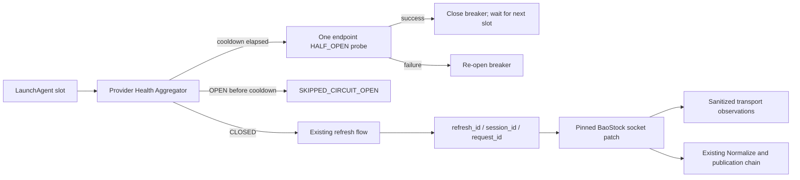

# Stock EVA R2-F0.1 Provider Transport Stabilization Design

**Date:** 2026-08-12 (Asia/Shanghai)

**Status:** Approved implementation design

**Scope:** Offline code and test delivery only; no real provider request or production install

## 1. Objective

R2-F0.1 makes the incumbent BaoStock transport path diagnosable, fail-closed and circuit-broken.
It does not increase timeouts or retries and does not change normalization, quality gates,
immutable Parquet, SHA-256, manifest or atomic publication behavior.

## 2. Decisions

- Keep `baostock==0.9.3`, but replace its unsafe socket functions at the project adapter boundary
  with a version- and SHA-pinned project patch. Never edit `site-packages`.
- Use `sendall()` and a bounded framed receive loop. A short header, missing end marker, EOF,
  decompression failure or malformed protocol raises a typed sanitized error.
- Give every data call exactly one allowlisted endpoint identity:
  `trade_dates`, `all_stock`, `daily_astock`, `daily_factor`, `adjust_factor`, or
  `index_history`.
- Establish a refresh scope before provider work. It owns `refresh_id`; each login owns a
  `provider_session_id`; each request attempt owns a `request_id`.
- Collect `recv_calls`, `response_bytes` and `end_marker_seen` inside the patched receive loop.
  Do not infer them from SDK result objects.
- Persist only sanitized transport observations and breaker state in a separate local control
  SQLite database. Never store payloads, credentials, URLs, provider messages or exception text.
- Keep diagnostic canaries write-free by using an in-memory observation sink and in-memory breaker.
  A canary uses `max_attempts=1` and an independent login/session per endpoint.
- An endpoint breaker opens after a configurable number of terminal refresh failures. Provider
  health is `OPEN` if any required endpoint is open, `HALF_OPEN` while exactly one cooldown probe is
  leased, otherwise `CLOSED`.
- A scheduled slot encountering `OPEN` records `SKIPPED_CIRCUIT_OPEN` without a full provider
  refresh. After cooldown, the slot may run only the failed endpoint's one-attempt independent
  probe. A successful probe closes the breaker but does not continue into a full refresh in the
  same slot.
- Breaker accounting is per terminal endpoint outcome, not per internal retry. The existing
  `max_attempts=2` and 30-second deadline are retained unchanged.

## 3. Data flow



## 4. Transport observation contract

Every observation records only:

```text
refresh_id
provider_session_id
request_id
provider_id
endpoint
attempt
page
protocol_stage
elapsed_ms
recv_calls
response_bytes
end_marker_seen
provider_code
normalized_error
outcome
observed_at
```

`normalized_error` is allowlisted and includes:

```text
CONNECT_ERROR
SEND_ERROR
RECV_TIMEOUT
EOF
SHORT_HEADER
BAD_COMPRESSION
PROTOCOL_ERROR
PAGINATION_STALLED
RATE_LIMIT
UNKNOWN_PROVIDER_PROTOCOL_ERROR
```

Unknown provider codes retain `provider_code` and map to
`UNKNOWN_PROVIDER_PROTOCOL_ERROR`; message text is never used to guess semantics.

## 5. Fail-closed rules

- The header must be at least 21 bytes and split into a valid version/type/body-length tuple.
- The response must end with the BaoStock protocol marker.
- Compressed responses must decompress successfully and respect the declared compressed length.
- A socket EOF before a complete frame is an `EOF`, never an empty successful response.
- A paginated response must advance its page number, must not repeat a page fingerprint, and must
  not stop after an exactly full page without an explicit terminal page.
- Schema shape, duplicate symbols and expected universe/row-count coverage remain candidate gates;
  any violation invalidates the complete provider candidate.
- No transport or protocol failure may return already collected rows as a successful partial batch.

## 6. Recovery and canary boundary

The default CLI form is a zero-network plan. Network execution requires both `--execute` and an
explicit acknowledgement flag. It never initializes a control database, factor cache, Parquet
staging directory, manifest or pointer. Endpoint probes create and close an independent BaoStock
provider/session. Success only reports health; it does not refresh or publish.

## 7. Acceptance

- Offline tests identify the exact endpoint and protocol stage for blocking, partial-send, timeout,
  short-frame, missing-marker, bad-compression, EOF and pagination failures.
- Incomplete frames/pages and duplicate/universe anomalies fail the entire candidate.
- Repeated terminal failures open the endpoint and provider breakers; later scheduled slots skip
  full refresh; one HALF_OPEN probe safely closes or reopens the breaker.
- Existing canonical publication and immutability regression suites remain green.
- No live provider call, production install or production mutation occurs during R2-F0.1 code
  acceptance.

## 8. Deferred work

Gap Scanner plus Health-aware Repair Queue begins only after R2-F0.1 GO. Provider-neutral raw
evidence, a second source, 20-session shadow qualification and default-off whole-session failover
remain R2-F2 through R2-F4 work. Symbol-level source stitching remains prohibited.
