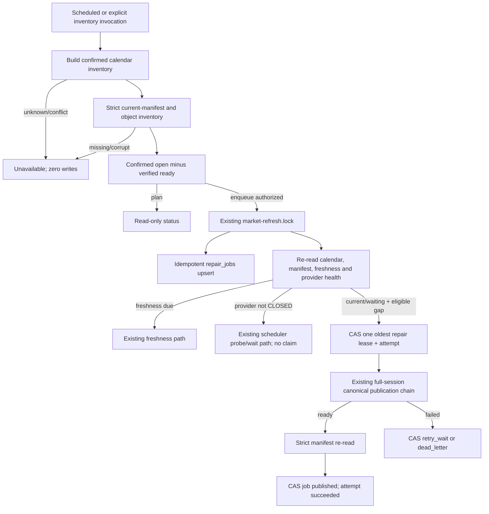

# Stock EVA R2-F1 Continuity Controller Design

**Author:** Codex delivery team
**Date:** 2026-08-13 (Asia/Shanghai)
**Status:** Approved for offline implementation — root quality review accepted on 2026-08-13
**Decision authority:** The user explicitly approved starting the next R2-F stage on 2026-08-13
**Scope:** Offline code and tests for Gap Scanner + Health-aware Repair Queue only
**Related documents:**

- [R2-F roadmap](2026-08-12-stock-eva-r2f-data-reliability-roadmap.md)
- [Prior umbrella implementation plan](2026-08-12-stock-eva-r2f-data-reliability-implementation.md)
- [R2-F0.1 transport design](2026-08-12-stock-eva-r2f0-1-provider-transport-design.md)
- [R2-F0.1 transport implementation](2026-08-12-stock-eva-r2f0-1-provider-transport-implementation.md)
- [R2-F0.1 acceptance](../acceptance/release-2-r2f0-1.md)

This specification supersedes Tasks 4–6 in the umbrella implementation plan for R2-F1 only. It
does not change the R2-F2 through R2-F5 scope or authorize production activity.

## Context

The current scheduler follows one latest expected session and a finite retry schedule. The local
control pointer (`published_snapshots`) is intentionally a singleton and therefore proves only the
latest publication. It cannot prove that every earlier confirmed trading session is present. A
failed old session can consequently remain absent without a durable repair obligation.

The current dataset does have an atomic cumulative `manifest.json`. Each accepted session is a
separate immutable Parquet partition referenced by that manifest. Existing `manifest_dates()`
validates manifest metadata, but it does not prove that every referenced object still exists and
matches its SHA-256, schema and row count. R2-F1 therefore needs an explicit verified inventory API;
neither the latest control pointer, `refresh_runs`, mutable DuckDB bars nor the reserved but unused
`manifests/history` directory is an authoritative continuity inventory.

R2-F0.1 added persistent endpoint/provider health and the `CLOSED / OPEN / HALF_OPEN` circuit. The
repair lane must compose with that state: it cannot claim work while provider health is unavailable
or not `CLOSED`, and it cannot create a second HALF_OPEN mechanism. It must also preserve the
existing `Normalize -> Quality Gate -> Immutable Parquet -> SHA-256 -> Manifest -> Atomic Publish`
path without direct object or pointer edits.

R2-F1 solves only continuity detection, durable repair intent and safe scheduling. It does not add
provider-neutral raw evidence, a second provider, symbol-level stitching or automatic failover.
All implementation and acceptance in this version are offline-only with fake providers and
temporary roots.

## Design decisions and corrected ambiguities

1. **Authoritative published inventory.** Add a public strict read API on `NasMarketStore` that
   captures one atomic current-manifest snapshot and verifies every referenced object for presence,
   safe path, SHA-256, Parquet schema and declared row count before returning its session set. The
   current manifest's partition entries are enumerated; the latest DuckDB pointer is not used.
2. **Dataset mode is required to claim continuity.** A mutable local-only `MarketStore` has no
   immutable manifest proof. It reports continuity `unavailable` and schedules no repair. It must
   not substitute `available_dates()` as evidence.
3. **Explicit lower boundary.** `market_continuity_start_date` defaults to `None`. Until configured,
   automatic inventory/repair is unavailable. This prevents an accidental scan back to an assumed
   origin. A CLI `--start` may narrow the configured range but cannot override it earlier.
4. **Pure scan before writes.** Calendar coverage and manifest inventory are completely validated
   before any continuity schema initialization, enqueue, lease, provider construction or canonical
   write.
5. **Writer-owned additive queue.** `repair_jobs` and `repair_attempts` live in the existing local
   market DuckDB, whose lifecycle is owned by the market writer. They are not placed in the provider
   health SQLite database and never live on NAS. Their DDL is an explicit writer migration under
   `market-refresh.lock`; generic reads and unrelated writer connections do not initialize them.
6. **One global writer/refresh lock.** Inventory enqueue, lease reclaim/claim and the full repair
   execution use the existing `market-refresh.lock`. DuckDB mutations are short transactions; the
   database transaction is never held across a provider call or manifest publication.
7. **CAS despite the process lock.** Every job has a monotonically increasing `state_version`.
   Claims and terminal updates compare the expected version, state, lease id and owner. This makes
   stale workers fail closed and retains correctness if another writer entry point is added later.
8. **Queue lifecycle, not pipeline internals.** Job states are `pending`, `leased`, `retry_wait`,
   `published`, and `dead_letter`. Fetch/validate/publish failure stage remains in the existing
   `RefreshResult` and sanitized attempt record; R2-F1 does not insert hooks into the canonical
   pipeline merely to decorate intermediate states.
9. **Audited stale recovery.** An expired `leased` job never silently returns to `pending`. The
   active attempt becomes `abandoned`, `abandoned_attempt_count` increments, and the job moves to
   `retry_wait` with a new version and future due time. Terminal states never reopen automatically.
10. **Dead-letter policy.** A non-retryable result dead-letters immediately. Retryable failures use
    a configurable whole-job budget (default four attempts) and a configurable base wait (default
    one hour, exponential and capped at 24 hours). A dead-letter job does not block other dates and
    is never silently re-enqueued. If an explicitly authorized external/manual workflow later
    publishes its date, verified manifest evidence may reconcile it to `published`; this is the only
    allowed transition out of `dead_letter`.
11. **Freshness always wins a decision.** A due latest session is selected before any historical
    job. When freshness is current or waiting for a later retry slot, one invocation may claim at
    most one strictly older repair. The controller never loops through the backlog. An already
    running non-preemptive repair remains bounded to one session and the existing transport limits.
12. **Provider health before claim.** Only `CLOSED` permits a repair claim. `OPEN`, `HALF_OPEN`, or
    an unreadable/missing health store leaves job and attempt counts unchanged. The existing
    scheduler health path alone acquires and resolves HALF_OPEN probes; repair code never does.
13. **Exactly-once logical promotion.** Under the shared lock, the controller re-reads the verified
    manifest before claiming. A date already present is reconciled to `published` without provider
    work. After a crash following manifest publication but before queue finalization, the next scan
    observes the immutable partition and finalizes the job without republishing it.
14. **Current-provider scope only.** The deterministic key is
    `repair:{trade_date}:{universe_id}`, with `universe_id=all-main-board` for the current canonical
    scope. This is a scheduler scope label, not the future R2-F4 versioned Universe Contract.
15. **Safe rollback.** `market_repair_enabled` defaults to `False`. Disabling it stops claims and
    execution while retaining verified inventory, jobs, attempts and read-only status. The old
    freshness scheduler remains the fallback; rollback never drops tables or audit rows.

## Functional Requirements

- FR-1: The controller MUST require a configured `market_continuity_start_date` before it can
  claim the continuity range as known or enqueue repairs.
- FR-2: The controller MUST NOT inspect or enqueue a date before
  `market_continuity_start_date`.
- FR-3: The scan end MUST be the latest expected completed session, or an explicitly narrower
  requested end; it MUST NOT include a future or not-yet-available session.
- FR-4: Every date in the scan range MUST resolve through the bundled confirmed calendar as
  `open` or `closed`. Any `unknown` year/date or recorded calendar conflict MUST make the whole scan
  unavailable.
- FR-5: Published-ready sessions MUST come only from a public strict immutable inventory API
  over one current manifest snapshot whose referenced objects pass safe-path, existence, SHA-256,
  Parquet-schema and row-count validation.
- FR-6: The controller MUST NOT use `published_snapshots`, `refresh_runs`, DuckDB
  `available_dates()`, or reserved manifest-history directories as a substitute for FR-5.
- FR-7: The pure gap scan MUST compute exactly
  `confirmed_open_sessions - verified_ready_sessions`, sorted oldest first.
- FR-8: A calendar or manifest validation error MUST return a sanitized unavailable result and
  MUST cause zero queue, attempt, provider, Parquet, manifest and pointer writes.
- FR-9: The writer MUST persist additive `repair_jobs` and `repair_attempts` tables in the local
  market DuckDB without rewriting legacy market rows or immutable objects.
- FR-10: Enqueue MUST use deterministic key `repair:{trade_date}:{universe_id}` and be
  idempotent across repeated scans, process restart and concurrent entry points.
- FR-11: Every job mutation MUST enforce an allowed transition, matching `state_version`, and
  matching lease identity when the job is leased.
- FR-12: A claim MUST create exactly one running attempt and one bounded lease in the same
  DuckDB transaction.
- FR-13: An expired lease MUST be recovered only after expiry by recording the attempt as
  `abandoned`, incrementing the abandoned counter and moving the job to `retry_wait`.
- FR-14: A retryable failure below budget MUST record a sanitized failed attempt and move the
  job to `retry_wait` with a strictly future UTC `next_attempt_at`.
- FR-15: A non-retryable failure or exhausted retry budget MUST move the job to `dead_letter`
  and MUST NOT block a different eligible date.
- FR-16: The scheduler MUST choose a due freshness run before any repair job.
- FR-17: The scheduler MAY choose at most one oldest eligible historical repair only when
  freshness is current or waiting for a later retry slot.
- FR-18: A repair target MUST be strictly older than the current latest expected session; the
  newest missing session remains owned by the freshness lane until a newer expected session exists.
- FR-19: Both lanes MUST use the existing non-blocking cross-process `market-refresh.lock` and
  MUST re-evaluate calendar, manifest, freshness, provider health and lease eligibility after the
  lock is acquired.
- FR-20: Provider health MUST be read before repair claim. `OPEN`, `HALF_OPEN`, missing or
  unreadable health state MUST cause no repair claim, no attempt and no provider request, while
  preserving pending/retry-wait work unchanged.
- FR-21: Only the existing scheduler provider-health handler MAY acquire or resolve a HALF_OPEN
  probe. Repair components MUST NOT probe or close a provider circuit.
- FR-22: A repair MUST call the existing complete-session publication function with
  `symbols=None`, current required symbols, `run_kind="repair"`, and a deterministic job request
  key. It MUST NOT fetch or publish a symbol slice.
- FR-23: A repair MUST pass through the unchanged normalization, quality, immutable Parquet,
  SHA-256, manifest and atomic publication gates. It MUST NOT directly edit Parquet, manifests or
  pointers.
- FR-24: A verified manifest date MUST reconcile its job to `published` without a provider
  request. This rule MUST close the crash window between canonical publication and queue finalizing.
- FR-25: `RefreshResult.run_kind` MUST add `repair` without changing stored legacy
  `daily`/`backfill` rows or requiring a rewrite of the existing VARCHAR column.
- FR-26: `GET /api/v1/market/status` MUST expose additive sanitized continuity summary fields.
  Missing continuity tables MUST return `continuity_status="unavailable"` without initializing or
  migrating the database.
- FR-27: The `market-continuity` CLI without `--execute` MUST be network-free and write-free,
  including no directory, DuckDB, SQLite, manifest or pointer creation.
- FR-28: `market-continuity --execute` MUST only persist the verified scan and enqueue jobs. It
  MUST make zero provider requests and MUST validate all range/input evidence before constructing a
  writer.
- FR-29: Public and CLI status MUST expose only allowlisted state, dates, counts, lane and
  sanitized reason codes; it MUST NOT expose absolute paths, provider payloads, URLs, tokens or raw
  exception text.
- FR-30: Setting `market_repair_enabled=False` MUST disable repair claim/execution while
  preserving scan/status and all previously recorded evidence.

## Non-Functional Requirements

- NFR-1 (Fail closed): Unknown/corrupt calendar, manifest, object or control state MUST produce
  zero continuity/canonical writes in before/after filesystem and database fingerprints.
- NFR-2 (Concurrency): In a two-process claim test for one job, exactly one process MUST return
  a lease and exactly one running attempt MUST exist.
- NFR-3 (Bounded work): One scheduler invocation MUST start no more than one full-session repair
  and MUST never loop over the remaining backlog.
- NFR-4 (Freshness priority): For every decision with a due freshness target, repair claim count
  and repair provider-call count MUST both be zero.
- NFR-5 (Durability): Committed jobs, attempts, state versions and leases MUST survive process
  restart; an uncommitted transaction MUST leave no partial row.
- NFR-6 (Time): All persisted timestamps MUST be timezone-aware UTC. Calendar/session boundary
  calculations MUST use `Asia/Shanghai`. Naive datetimes MUST be rejected.
- NFR-7 (Read-only): Market status and CLI planning tests MUST prove identical file tree,
  byte hashes, sizes, mtimes and DuckDB schema before and after the read.
- NFR-8 (Compatibility): With repair disabled and no continuity tables, existing freshness
  decisions and all existing response fields MUST retain their prior semantics.
- NFR-9 (Sanitization): New tables/models/JSON outputs MUST have no field capable of storing
  payload, URL, token, arbitrary exception or absolute path. Tests MUST inspect schema and output.
- NFR-10 (No transport-policy weakening): R2-F1 MUST NOT increase BaoStock timeouts, normal
  attempts, circuit thresholds, retry-slot frequency, coverage thresholds or factor gates.
- NFR-11 (Offline delivery): Every R2-F1 test and review command MUST use fakes and temporary
  roots. Real provider, installation, production, NAS and LaunchAgent actions are prohibited.

## Acceptance Criteria

### AC-1: Exact gap set (FR-1–FR-7)

Given a configured continuity start, a fully confirmed calendar with five open sessions and a
strict verified manifest inventory containing three of them
When the pure scanner runs
Then it returns exactly the other two dates oldest first
And it performs zero writes and zero provider requests.

### AC-2: Lower and upper boundaries (FR-1–FR-3)

Given open sessions before the configured start and after the latest completed session
When inventory runs with no explicit narrowing range
Then neither outside session is scanned or enqueued.

### AC-3: Unknown calendar is zero-write (FR-4, FR-8; NFR-1)

Given a scan range containing a date from an unknown calendar year
When plan or execute is requested
Then continuity is unavailable with an allowlisted calendar reason
And no runtime path, queue row, attempt, provider request or canonical byte changes.

### AC-4: Corrupt immutable inventory is zero-write (FR-5, FR-8; NFR-1)

Given a missing object, wrong checksum, wrong row count, incompatible schema, unsafe path or corrupt
current manifest
When the scanner builds the verified inventory
Then the complete scan fails unavailable
And no job is enqueued and no canonical pointer changes.

### AC-5: Restart-safe idempotent enqueue (FR-9, FR-10; NFR-5)

Given the same two missing sessions are scanned before and after a process restart
When execute-enqueue runs repeatedly
Then exactly two jobs with deterministic ids exist
And no attempt exists before a claim.

### AC-6: Atomic concurrent claim (FR-11, FR-12, FR-19; NFR-2)

Given two processes observe the same eligible pending job
When both contend through the shared lock and CAS claim
Then exactly one obtains a lease and one running attempt
And the loser makes zero provider calls and no state transition.

### AC-7: Stale lease recovery (FR-11–FR-13; NFR-5, NFR-6)

Given a process dies after a job and attempt are leased
When another process inspects before lease expiry
Then it cannot claim or mutate the job
And when it inspects after expiry, it records one abandoned attempt, increments the abandoned count,
moves the job to future `retry_wait`, and increments `state_version` exactly once.

### AC-8: Freshness cannot be starved (FR-16, FR-17, FR-18, FR-19; NFR-3, NFR-4)

Given an old eligible repair and a newly due latest session
When one scheduler invocation decides work
Then it selects only freshness
And the old job remains durable and unchanged.

### AC-9: One repair while freshness waits/current (FR-17–FR-19; NFR-3)

Given freshness is current or waiting for a later retry and three historical jobs are eligible
When one scheduler invocation runs
Then only the oldest job is claimed
And the other two remain unchanged.

### AC-10: Provider health blocks claim (FR-20, FR-21)

Given an eligible repair and provider state `OPEN`, `HALF_OPEN`, missing or unreadable
When the scheduler evaluates repair
Then it creates no lease or attempt and calls no repair provider
And any HALF_OPEN action is handled only by the existing scheduler probe path.

### AC-11: Retry and dead letter (FR-14, FR-15)

Given a claimed repair returns retryable failures up to its configured budget
When each attempt is finalized
Then pre-budget failures enter future `retry_wait`, the exhausted attempt enters `dead_letter`, all
attempts remain queryable, and a later different date can still be claimed.

### AC-12: Exactly-once crash reconciliation (FR-22–FR-24)

Given a repair has atomically published a complete immutable date but the process dies before the
job finalization transaction
When the next invocation re-scans under the shared lock
Then strict manifest evidence transitions the job to `published`
And provider and publication call counts for that date remain zero in the recovery invocation.

### AC-13: Whole-session publication only (FR-22, FR-23; NFR-10)

Given a repair is allowed to execute
When the provider returns a partial, duplicate, wrong-universe or otherwise invalid candidate
Then the entire attempt fails through existing gates
And no partial Parquet, manifest or pointer publication occurs.

### AC-14: Additive run-kind migration (FR-9, FR-25; NFR-8)

Given a legacy market database containing `daily` and `backfill` refresh rows
When the writer migration creates continuity tables and a repair run is persisted
Then all legacy rows remain byte/semantically readable
And the repair row reads as `run_kind="repair"` without rewriting immutable data.

### AC-15: Read-only API and CLI (FR-26, FR-27, FR-28, FR-29; NFR-7, NFR-9)

Given missing continuity tables or a corrupt continuity table in an otherwise readable market
control database
When market status or `market-continuity` planning is read
Then the response is sanitized and reports continuity unavailable
And the filesystem, database bytes and schema are unchanged.

### AC-16: Rollback switch (FR-30; NFR-8)

Given verified gaps and persisted pending jobs
When `market_repair_enabled` changes from true to false
Then subsequent automatic invocations claim no repair and preserve every job/attempt
And existing freshness scheduling remains available.

## Edge Cases

- EC-1: `continuity_start_date` missing, after requested end or in the future -> unavailable;
  zero writes.
- EC-2: CLI `--start` is earlier than configured start -> validation error; zero directories or
  database initialization.
- EC-3: CLI `--end` is after latest completed session or `--start > --end` -> validation error;
  zero writes.
- EC-4: Calendar range crosses one unknown day/year -> reject the entire range, not only the
  unknown suffix.
- EC-5: Calendar maintenance reports conflict -> reject even if bundled weekday lookup says
  open.
- EC-6: Current manifest is missing, unreadable, oversized, malformed or unsupported ->
  unavailable; no queue initialization.
- EC-7: Manifest has duplicate partition/date, unsafe path or unexpected source -> reject all
  inventory.
- EC-8: Referenced Parquet is missing, changes during verification, has wrong SHA/schema/row
  count or cannot be read -> reject all inventory.
- EC-9: A valid manifest is empty -> all confirmed open sessions inside the explicit boundary
  are missing; this is not a corrupt inventory.
- EC-10: Mutable local-only mode -> continuity unavailable; never infer readiness from DuckDB
  rows.
- EC-11: Repeated enqueue of pending, leased, retry-wait, published or dead-letter job -> no
  duplicate and no backward state transition.
- EC-12: Job is enqueued, then its session appears in the manifest before claim -> reconcile to
  published; zero provider work.
- EC-13: Stale worker tries to finalize after lease recovery -> CAS rejection; current job and
  newer attempt remain unchanged.
- EC-14: Process dies before claim transaction commit -> no job/attempt mutation.
- EC-15: Process dies after claim commit -> lease remains until expiry and becomes one abandoned
  attempt.
- EC-16: Process dies after manifest publish but before queue finalize -> AC-12 reconciliation.
- EC-17: Queue/control schema is missing on a read path -> continuity unavailable without
  migration.
- EC-18: Queue/control schema is malformed -> sanitized unavailable, never auto-repaired by GET.
- EC-19: DuckDB writer is busy or shared lock is held -> `already_running`; no claim/state
  transition.
- EC-20: Provider health DB is absent/corrupt -> preserve pending work; no repair provider.
- EC-21: Provider opens after decision but before claim -> re-read under lock blocks claim.
- EC-22: Provider opens during a claimed repair -> current complete attempt may fail and is
  finalized once; no second repair starts in the invocation.
- EC-23: All jobs are dead-letter but a newer pending date exists -> newer pending date remains
  claimable.
- EC-24: A manual authorized refresh later fills a dead-letter date -> strict scan may reconcile
  dead-letter to published, but never to pending.
- EC-25: Repair result is `partial` or `error` despite a transport success -> it is an attempt
  failure, never a publication success.
- EC-26: Repair publishes an older date -> the current latest control pointer MUST NOT regress;
  the cumulative manifest gains the older ready partition atomically.
- EC-27: API serialization sees internal unknown state/reason -> emit `unavailable` and an
  allowlisted generic code, not raw values.
- EC-28: UTC daylight/offset boundary -> persisted UTC ordering remains deterministic; exchange
  session calculations remain Shanghai-local.

## API Contracts

### 7.1 Strict immutable inventory

```typescript
interface VerifiedReadySessionInventory {
  status: "ready";
  source: "baostock";
  manifestGeneration: string;
  manifestIdentity: string;       // internal hash identity; never an absolute path
  sessions: readonly LocalDate[]; // sorted and unique
  verifiedAt: UTCDateTime;
}

interface ReadySessionInventoryReader {
  verifiedReadySessionInventory(source: "baostock"): VerifiedReadySessionInventory;
}
```

The implementation MUST capture one `_read_snapshot(verify_checksums=True)` view and derive the
session list from that same parsed manifest payload. `manifest_dates()` remains a lightweight
resume helper and MUST NOT be used by R2-F1.

### 7.2 Pure scan

```typescript
interface ContinuityScanRequest {
  configuredStart: LocalDate;
  requestedStart?: LocalDate;
  requestedEnd?: LocalDate;
  latestExpectedSession: LocalDate;
  calendarStatus: "confirmed";
  manifest: VerifiedReadySessionInventory;
}

interface ContinuityScanResult {
  status: "current" | "gaps";
  effectiveStart: LocalDate;
  effectiveEnd: LocalDate;
  manifestGeneration: string;
  confirmedOpenSessions: readonly LocalDate[];
  publishedReadySessions: readonly LocalDate[];
  missingSessions: readonly LocalDate[];
  writesControlState: false;
  providerRequests: 0;
}

interface ContinuityUnavailable {
  status: "unavailable";
  reasonCode:
    | "CONTINUITY_START_UNCONFIGURED"
    | "CONTINUITY_RANGE_INVALID"
    | "CALENDAR_UNAVAILABLE"
    | "CALENDAR_CONFLICT"
    | "MANIFEST_INVENTORY_UNAVAILABLE"
    | "IMMUTABLE_OBJECT_INVALID";
  writesControlState: false;
  providerRequests: 0;
}
```

### 7.3 Queue and decision service

```typescript
type RepairJobState =
  | "pending"
  | "leased"
  | "retry_wait"
  | "published"
  | "dead_letter";

type RepairAttemptOutcome = "running" | "succeeded" | "failed" | "abandoned";

interface RepairLease {
  jobId: string;
  attemptId: string;
  leaseId: string;
  owner: string;
  targetSession: LocalDate;
  stateVersion: number;
  expiresAt: UTCDateTime;
}

interface ContinuityDecision {
  action: "run" | "wait" | "none";
  lane: "freshness" | "repair" | null;
  targetSession: LocalDate | null;
  repairJobId: string | null;
  nextRunAt: UTCDateTime | null;
  reasonCode: string | null; // allowlisted values only
}
```

### 7.4 HTTP status extension

`GET /api/v1/market/status` retains its existing response and adds:

```typescript
interface MarketContinuityStatus {
  continuityStatus: "current" | "gaps" | "blocked" | "unavailable";
  continuityStartDate: LocalDate | null;
  missingSessionCount: number;
  oldestMissingSession: LocalDate | null;
  repairExecutionEnabled: boolean;
  repairPendingCount: number;
  repairRetryWaitCount: number;
  repairActiveCount: number;
  repairDeadLetterCount: number;
  activeLane: "freshness" | "repair" | null;
  continuityReasonCode: string | null;
}
```

Status mapping is deterministic:

- `unavailable`: the continuity start, calendar, immutable inventory or continuity-control reader
  cannot be proven; use one of `CONTINUITY_START_UNCONFIGURED`, `CALENDAR_UNAVAILABLE`,
  `CALENDAR_CONFLICT`, `MANIFEST_INVENTORY_UNAVAILABLE` or `CONTROL_STATE_UNAVAILABLE`.
- `current`: the strict scan contains zero missing sessions, regardless of whether repair execution
  is enabled.
- `gaps`: missing sessions exist and at least one matching job is pending, waiting or leased with
  repair execution enabled and provider health `CLOSED`.
- `blocked`: missing sessions are proven but progress is currently prevented. The allowlisted reason
  is one of `REPAIR_EXECUTION_DISABLED`, `PROVIDER_CIRCUIT_OPEN`,
  `PROVIDER_CIRCUIT_HALF_OPEN`, `PROVIDER_HEALTH_UNAVAILABLE`,
  `REPAIR_QUEUE_NOT_ENQUEUED` or `REPAIR_DEAD_LETTER_ONLY`.

`activeLane` is `repair` when a non-expired repair lease exists, otherwise `freshness` when the
existing scheduler state is running, otherwise null. An unknown internal value degrades to
`unavailable/CONTROL_STATE_UNAVAILABLE` rather than being serialized.

HTTP and CLI plan reads MUST use the R2-F0.1 non-mutating provider-health snapshot API. Expired
HALF_OPEN lease reclamation remains an automatic writer/scheduler responsibility and cannot occur
as a side effect of status.

Missing/malformed continuity tables degrade only these additive fields. Existing base-market
control corruption retains the existing sanitized HTTP 503 behavior.

### 7.5 CLI

```text
market-continuity [--start YYYY-MM-DD] [--end YYYY-MM-DD] [--execute]
```

Planning output:

```typescript
interface MarketContinuityPlanOutput {
  status: "current" | "gaps" | "unavailable" | "error";
  effectiveStart: LocalDate | null;
  effectiveEnd: LocalDate | null;
  missingSessionCount: number;
  oldestMissingSession: LocalDate | null;
  writesControlState: false;
  providerRequests: 0;
  executeRequires: "--execute";
  reasonCode: string | null;
}
```

Execute output changes only `writesControlState` and enqueue counts/ids. It MUST still report
`providerRequests=0`, `writesParquet=false`, `writesManifest=false`, and `writesPointer=false`.

## Data Models

### 8.1 `repair_jobs` (DuckDB, additive)

| Field | Type | Constraints |
| --- | --- | --- |
| `job_id` | VARCHAR | Primary key; deterministic `repair:{date}:{universe_id}` |
| `trade_date` | DATE | Not null |
| `universe_id` | VARCHAR | Not null; R2-F1 value `all-main-board` |
| `state` | VARCHAR | Not null; allowlisted `RepairJobState` |
| `state_version` | BIGINT | Not null, starts at 1, increments on every accepted mutation |
| `attempt_count` | INTEGER | Not null, >= 0; counts claimed whole-job attempts |
| `abandoned_attempt_count` | INTEGER | Not null, >= 0 |
| `next_attempt_at` | TIMESTAMPTZ | Null unless waiting/due policy requires it; UTC |
| `lease_id` | VARCHAR | Present only while leased |
| `lease_owner` | VARCHAR | Present only while leased; sanitized id |
| `lease_expires_at` | TIMESTAMPTZ | Present only while leased; UTC |
| `last_attempt_id` | VARCHAR | FK-like audit reference; null before first claim |
| `last_failure_stage` | VARCHAR | Sanitized existing failure-stage vocabulary or null |
| `last_failure_class` | VARCHAR | Sanitized existing failure-class vocabulary or null |
| `created_at` | TIMESTAMPTZ | Immutable UTC |
| `updated_at` | TIMESTAMPTZ | UTC, changes with state version |
| `published_at` | TIMESTAMPTZ | Null until strict manifest evidence proves published |

Constraints: unique `(trade_date, universe_id)`; lease fields are all-null or all-present; terminal
states carry no lease; no payload/message/path column exists.

### 8.2 `repair_attempts` (DuckDB, append-only except one terminal update)

| Field | Type | Constraints |
| --- | --- | --- |
| `attempt_id` | VARCHAR | Primary key; safe generated id |
| `job_id` | VARCHAR | Not null; references deterministic job |
| `attempt_number` | INTEGER | Not null, > 0; unique with `job_id` |
| `lease_id` | VARCHAR | Not null; immutable attempt lease identity |
| `lease_owner` | VARCHAR | Not null; sanitized id |
| `outcome` | VARCHAR | `running`, then exactly one terminal value |
| `refresh_run_id` | VARCHAR | Sanitized existing refresh audit id or null |
| `failure_stage` | VARCHAR | Sanitized or null |
| `failure_class` | VARCHAR | Sanitized or null |
| `retryable` | BOOLEAN | Null while running; terminal otherwise |
| `started_at` | TIMESTAMPTZ | Immutable UTC |
| `completed_at` | TIMESTAMPTZ | Null while running; UTC terminal time |

Attempt rows never store `error_message`, `quality_issues`, provider response text, payload, URL,
path or credentials.

### 8.3 Allowed state transitions

```text
pending    -> leased | published
retry_wait -> leased | published
leased     -> retry_wait | published | dead_letter
dead_letter -> published   # only strict external/canonical manifest reconciliation
published  -> (terminal)
```

`leased -> retry_wait` is valid only for a finalized retryable failure or an audited expired lease.
No state transitions to `pending`; repeated inventory only adds a missing deterministic job if no
job exists.

## Data flow



## Rollback and operational boundary

- Set `STOCK_EVA_MARKET_REPAIR_ENABLED=false` to stop all repair claim/execution.
- Do not delete `repair_jobs`, `repair_attempts`, refresh audit or provider-health evidence.
- Do not rewrite manifests or Parquet to undo R2-F1 metadata.
- Freshness scheduling continues through its existing path.
- A schema downgrade reader may ignore the additive tables and `repair` audit rows; immutable
  publication bytes remain compatible.
- Real provider canary, runtime installation, production repair, NAS access and LaunchAgent changes
  are not part of R2-F1 offline code acceptance and require separate explicit authorization.

## Out of Scope

- OS-1: Provider-neutral RAW Evidence Framework — R2-F2; do not generalize queue/provider models
  in advance.
- OS-2: Second-provider adapters, comparison or shadow scheduling — R2-F3.
- OS-3: Automatic or manual failover policy — R2-F4; remains disabled.
- OS-4: Symbol-level mixing — permanently prohibited for canonical sessions.
- OS-5: Versioned Universe Contract — R2-F4; `all-main-board` here is only the current scope
  label.
- OS-6: Calendar acquisition/version rollover — R2-F4; R2-F1 consumes confirmed calendar only.
- OS-7: Rewriting immutable Parquet, manifests or current pointer by hand — prohibited.
- OS-8: New LaunchAgent or tighter scheduler slots — reuse the current invocation and lock.
- OS-9: Automatic dead-letter requeue — requires a separately reviewed operator policy; manual
  authorized publication can be reconciled as published.
- OS-10: Changes to timeout, normal provider retry count, coverage/factor gates, normalization,
  hashing or atomic publication semantics.
- OS-11: Real provider requests, installation, production, NAS or LaunchAgent work in this
  version's code gate.

## Requirement-to-evidence matrix

| Requirement group | Planned authoritative evidence |
| --- | --- |
| FR-1–FR-8 | Pure scanner tests plus strict manifest corruption matrix and zero-write fingerprints |
| FR-9–FR-15 | DuckDB schema/compatibility, state-machine, CAS, restart and stale-lease tests |
| FR-16–FR-21 | Deterministic scheduler matrix, two-process lock/CAS tests and provider-health fakes |
| FR-22–FR-25 | Full-session fake publication, crash-window reconciliation and legacy run-kind tests |
| FR-26–FR-30 | API/CLI storage fingerprints, sanitization and rollback-switch tests |
| NFR-1–NFR-11 | Focused suites, full repository suite, Ruff/format/diff checks and independent review |

Root quality review accepted this specification on 2026-08-13. Offline implementation and the
independent final review are complete at exact code HEAD
336107be1149d829c0ea841dd2466982bff7d689, with High 0 / Medium 0 and verdict
R2-F1 OFFLINE CODE GO. This remains only an offline code gate; it cannot claim production R2-F1
GO, authorize a provider request, or start R2-F2 without explicit user approval.
